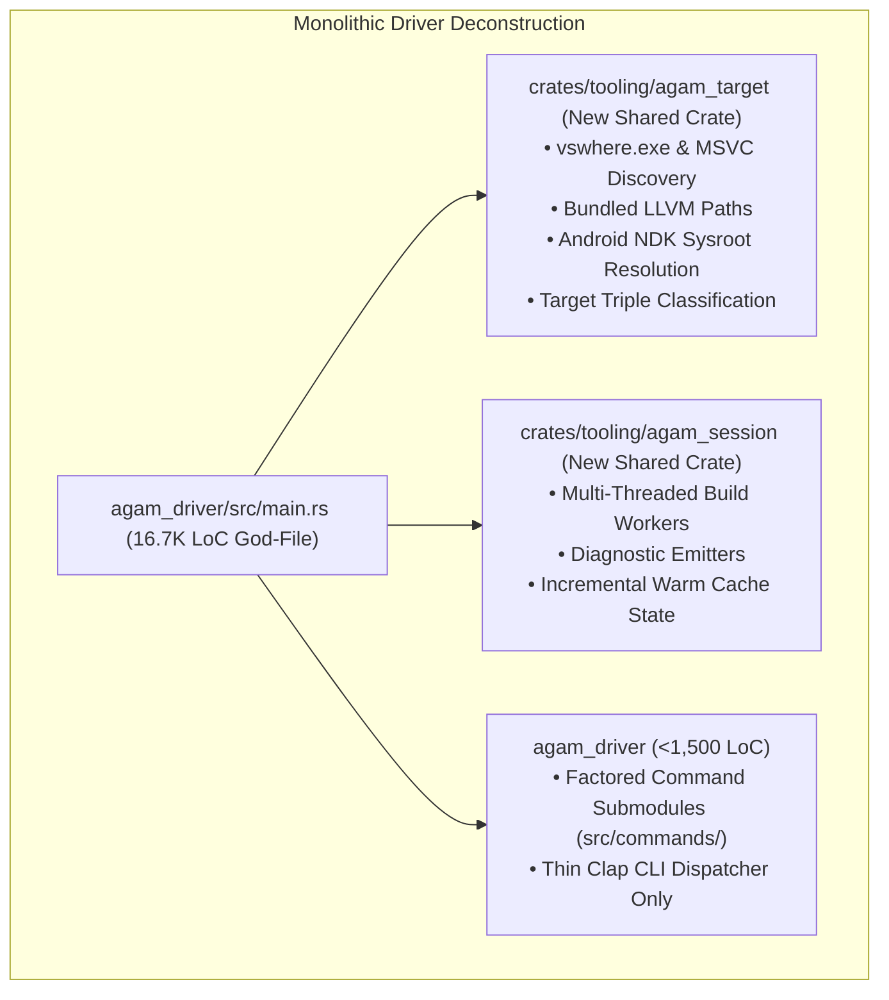

# Stage 0: Crate Decoupling, Inverted Driver Modularization & Zero-Panic Hardening

**Stage**: `Stage 0 (Active Engineering)`  
**Domain**: Compiler Architecture, Reliability, Diagnostics & Verification  
**Status**: **IN PROGRESS**  

---

## 1. Executive Summary & Problem Definition

The forensic codebase audit surfaced critical architectural technical debt:
- `agam_driver` has swelled to **33,411 lines (~28% of the codebase)**, with a single **16,768-line `main.rs` god-file** holding platform toolchain discovery, build worker pools, SBOM generators, and CLI dispatch.
- In unoptimized `dev` builds under MSVC on Windows, `fn main()`'s monolithic `match` arm frame causes `STATUS_STACK_OVERFLOW` (1MB limit) because MSVC debug codegen sums all local variables across all 16 subcommands without stack slot coloring.
- **2,489** `.unwrap()`, `.expect()`, and `panic!()` call sites exist across frontend and codegen crates.
- `agam_parser` contains zero token synchronization or error recovery logic, failing immediately on the first syntax error.
- The AOT backend has no structured pre-flight diagnostic when `clang` is missing on the host machine.
- Hand-rolled cryptographic primitives (ML-KEM/ML-DSA) and eBPF verifiers are un-audited and need explicit experimental gating.
- There is currently no differential testing pipeline comparing Cranelift JIT and LLVM AOT outputs.

---

## 2. Technical Deliverables & Architecture

### 2.1 Crate Extraction & Driver Decomposition
1. **`crates/tooling/agam_target`**:
   - `ToolchainDiscovery::find_msvc()`
   - `ToolchainDiscovery::find_bundled_llvm()`
   - `ToolchainDiscovery::detect_android_ndk()`
   - `ToolchainDiscovery::classify_target(triple)`
   - Reusable across `agamc`, `agam_codegen`, and `agam_lsp` without circular dependencies.
2. **`crates/tooling/agam_session`**:
   - Headless compilation pipeline orchestrator (`CompilerSession`, `SessionConfig`, worker pool).
3. **Factored `main.rs` Command Submodules**:
   - Split monolithic `match` into `src/commands/build.rs`, `run.rs`, `daemon.rs`, `doctor.rs`, reducing `main.rs` to $<1,500$ lines.

### 2.2 AOT Toolchain Pre-Flight Diagnostics
- If `clang` is missing during an AOT build or run request, emit a structured actionable diagnostic:
  `"error: Native Clang/LLVM toolchain was not found on PATH or Visual Studio. Install LLVM or pass '--backend jit' for in-process execution."`

### 2.3 Panic-Free Compiler Directive & Unwrap Ratchet
- Enforce `#![deny(clippy::unwrap_used)]` on compiler core crates (`agam_ast`, `agam_errors`, `agam_interface`).
- Add an unwrap ratchet CI test asserting that the global `.unwrap()`/`.expect()` count strictly decreases from 2,489 toward 0.
- Refactor all `.unwrap()` and `.expect()` calls to return `Result<T, Diagnostic>`.

### 2.4 Resilient Pratt Parser Recovery
- Implement Pratt panic-mode synchronization tokens (`;`, `}`, `fn`, `let`, `return`).
- Introduce `ast::Expr::Error` recovery AST nodes to enable multi-error diagnostic rendering in CLI and IDEs.

### 2.5 Security & Experimental Subsystems Guardrails
- Explicitly gate hand-rolled ML-KEM/ML-DSA PQC and eBPF verifiers behind an `--experimental-crypto` compiler flag.
- Plan migration to audited crates (`ml-kem`, `pqcrypto`, `aya-bpf`) for production builds.

### 2.6 Strict-Mode Affine Borrow Checker Expansion
- Expand `ownership.rs` test suite from 22 tests to 100+ comprehensive integration tests covering affine non-lexical lifetimes, mutable loan collisions, and partial struct moves.

### 2.7 Differential Testing Pipeline (JIT vs. AOT)
- Implement an automated differential testing runner in `agam_test::differential` that compiles randomized AST programs through both Cranelift JIT and LLVM AOT, asserting bit-for-bit identical execution outputs and return codes.

---

## 3. Verification & Acceptance Criteria
- [ ] `agam_driver/src/main.rs` is reduced from 16.7K to $< 1,500$ lines.
- [ ] `cargo check --all-targets` passes with 0 warnings.
- [ ] Missing `clang` pre-flight diagnostic tested and verified.
- [ ] Parser reports multiple syntax errors in a single file pass without crashing.
- [ ] Differential test runner verifies bitwise parity between JIT and AOT across test suites.
- [ ] Global unwrap/expect count strictly decreases from 2,489.
