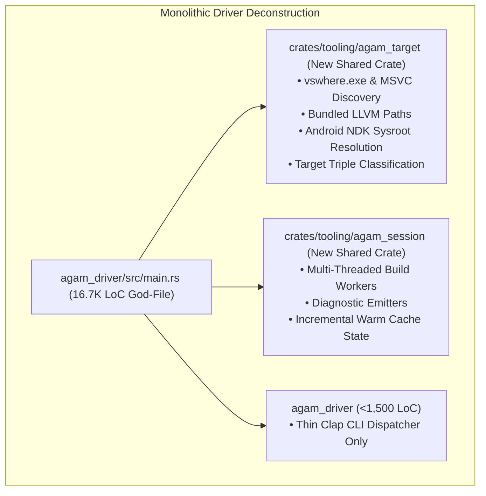

# Stage 0: Crate Decoupling, Inverted Driver Modularization & Zero-Panic Hardening

**Stage**: `Stage 0 (Active Engineering)`  
**Domain**: Compiler Architecture, Reliability & Verification  
**Status**: **IN PROGRESS**  

---

## 1. Executive Summary & Problem Definition

The forensic codebase audit surfaced a critical architectural code-smell:
- `agam_driver` has swelled to **33,411 lines (~28% of the codebase)**, with a single **16,768-line `main.rs` god-file** holding platform toolchain discovery, build worker pools, SBOM generators, and CLI dispatch.
- In unoptimized `dev` builds under MSVC on Windows, `fn main()` triggers `STATUS_STACK_OVERFLOW` (1MB limit) because the monolithic function frame contains hundreds of local variables across 16 subcommands.
- 2,476 `.unwrap()`, `.expect()`, and `panic!()` call sites exist across frontend and codegen crates.
- `agam_parser` contains zero token synchronization or error recovery logic, failing immediately on the first syntax error.

---

## 2. Technical Deliverables & Architecture

### 2.1 Crate Extraction
1. **`crates/tooling/agam_target`**:
   - `ToolchainDiscovery::find_msvc()`
   - `ToolchainDiscovery::find_bundled_llvm()`
   - `ToolchainDiscovery::detect_android_ndk()`
   - `ToolchainDiscovery::classify_target(triple)`
   - Reusable across `agamc`, `agam_codegen`, and `agam_lsp` without depending on CLI binary.
2. **`crates/tooling/agam_session`**:
   - Headless compilation pipeline orchestrator (`CompilerSession`, `SessionConfig`, worker pool).

### 2.2 Panic-Free Compiler Directive
- Refactor all `.unwrap()` and `.expect()` calls in `agam_parser`, `agam_sema`, `agam_hir`, `agam_mir`, and `agam_codegen` to return `Result<T, Diagnostic>`.
- Enforce `#![deny(clippy::unwrap_used)]` across compiler core crates.

### 2.3 Resilient Pratt Parser Recovery
- Implement Pratt panic-mode synchronization tokens (`;`, `}`, `fn`, `let`, `return`).
- Introduce `ast::Expr::Error` recovery AST nodes to enable multi-error diagnostic rendering in CLI and IDEs.

### 2.4 Fuzzing & Differential Verification
- Setup `cargo-fuzz` targets for parser and SEMA.
- Build automated differential runner comparing Agam JIT, Agam LLVM, and `clang -O3` on randomized inputs.

---

## 3. Verification & Acceptance Criteria
- [ ] `cargo check --all-targets` passes with 0 warnings.
- [ ] `agam_driver/src/main.rs` is reduced from 16.7K to $< 1,500$ lines.
- [ ] `agamc run` in unoptimized `dev` mode executes without stack overflow on Windows.
- [ ] Multi-error diagnostic tests verify that parser reports multiple syntax errors in a single pass.
