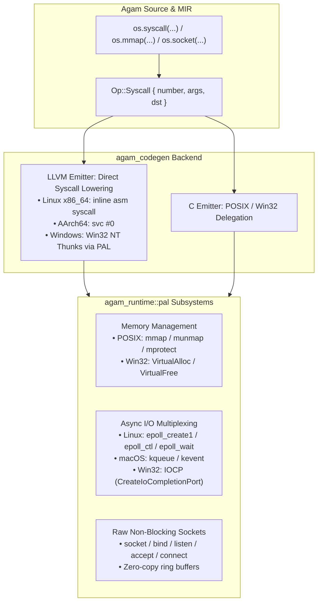

# Stage 3: Direct System Call & OS Subsystem Engine

**Stage**: `Stage 3 (Next Immediate Focus)`  
**Domain**: OS Kernel Interactions, Direct Syscalls & High-Throughput I/O  
**Status**: **ACTIVE / READY TO EXECUTE**  

---

## 1. Executive Summary & Problem Definition

To achieve bare-metal native performance comparable to C/C++ and Rust, Agam requires a first-party Platform Abstraction Layer (PAL) and direct syscall capabilities that bypass third-party library overhead.

---

## 2. Technical Deliverables & Architecture

### 2.1 Direct Syscall Lowering in `agam_mir` & `agam_codegen`
- **MIR IR**: Add `Op::Syscall { number: ValueId, args: Vec<ValueId>, dst: ValueId }`.
- **LLVM Codegen**:
  - Linux x86_64: Emit inline assembly `call i64 asm sideeffect "syscall", "={rax},{rax},{rdi},{rsi},{rdx},{r10},{r8},{r9}"`.
  - AArch64: Emit `svc #0` using `x8` system call register conventions.
  - Windows: Fast Win32 NT thunks in `agam_runtime::pal`.

### 2.2 Zero-Cost Memory Management (`agam_runtime::pal::memory`)
- Direct `mmap` / `munmap` on POSIX systems (`MAP_ANONYMOUS | MAP_PRIVATE`).
- Direct `VirtualAlloc` / `VirtualFree` on Windows (`MEM_COMMIT | MEM_RESERVE`).
- Huge page backing (`MAP_HUGETLB` / `MEM_LARGE_PAGES`) for large tensors.

### 2.3 High-Throughput I/O Event Multiplexing (`agam_runtime::pal::event`)
- Unified `EventLoop` trait supporting:
  - Linux `epoll` (`epoll_create1`, `epoll_ctl`, `epoll_wait`).
  - macOS/BSD `kqueue` (`kqueue`, `kevent`).
  - Windows I/O Completion Ports (`CreateIoCompletionPort`, `GetQueuedCompletionStatus`).

### 2.4 Raw Non-Blocking Sockets (`agam_runtime::pal::net`)
- Non-blocking TCP/UDP socket creation, `SO_REUSEADDR`, `TCP_NODELAY`.
- Fast asynchronous connect/accept without heavy third-party runtimes.

---

## 3. Verification & Acceptance Criteria
- [ ] Direct syscall test verifying `getpid` and monotonic clock reads.
- [ ] Memory allocator benchmark comparing `mmap`/`VirtualAlloc` arena vs standard heap.
- [ ] Socket loopback ping-pong test verifying non-blocking throughput.
- [ ] `cargo check` and `cargo test` pass with 0 warnings on both Linux and Windows.
