# Stage 6: Production Standard Library & Media Codecs

**Stage**: `Stage 6 (Planned Execution)`  
**Domain**: Real-World Applications, Media Codecs & Network Services  
**Status**: **PLANNED**  

---

## 1. Executive Summary & Problem Definition

To prove Agam's capabilities beyond synthetic micro-benchmarks, Stage 6 delivers production-grade media codecs and networking pipelines written in pure Agam.

---

## 2. Technical Deliverables & Architecture

```mermaid
flowchart TD
    subgraph Image["Image Processing Pipeline (4K UHD)"]
        PPM["Raw 4K PPM/PNG Ingestion"] --> Conv["3x3 & 5x5 Vectorized Convolution (Sobel/Sharpen)"]
        Conv --> Bilinear["Bilinear Interpolation & Scaling"]
    end

    subgraph Audio["Audio Codec Engine (FLAC 24-bit)"]
        PCM["24-bit 96kHz PCM Waveform"] --> LPC["LPC Autocorrelation (Levinson-Durbin)"]
        LPC --> Rice["Rice-Golomb Variable-Length Bitstream Encoding"]
    end

    subgraph Network["Production Async HTTP/1.1 & HTTP/2"]
        Sockets["Raw Socket PAL"] --> HTTP["HTTP Parser & Header Table (HPACK)"]
        HTTP --> AsyncHandler["Async Stackless Coroutine Dispatcher"]
    end
```

### 2.1 4K Image Convolution & Image Processing (`agam_std::image`)
- 4K ($3840 \times 2160$) image processing kernels with SIMD-accelerated 2D convolution and zero heap allocations during filtering loops.

### 2.2 FLAC Audio Encoder (`agam_std::audio`)
- Pure Agam 24-bit / 96kHz lossless FLAC encoder with Levinson-Durbin linear predictive coding (LPC) and Rice-Golomb entropy encoding.

### 2.3 High-Throughput Async HTTP Engine (`agam_std::http`)
- Zero-copy HTTP/1.1 and HTTP/2 protocol parser with async connection multiplexing.

---

## 3. Verification & Acceptance Criteria
- [ ] 4K image sharpen benchmark executes in $< 15\text{ ms}$ on 8-core CPU.
- [ ] FLAC encoding produces valid, bit-for-bit verifiable `.flac` audio stream verified against `flac -t`.
- [ ] HTTP throughput benchmark achieves $> 100,000\text{ req/sec}$ on localhost loopback.
