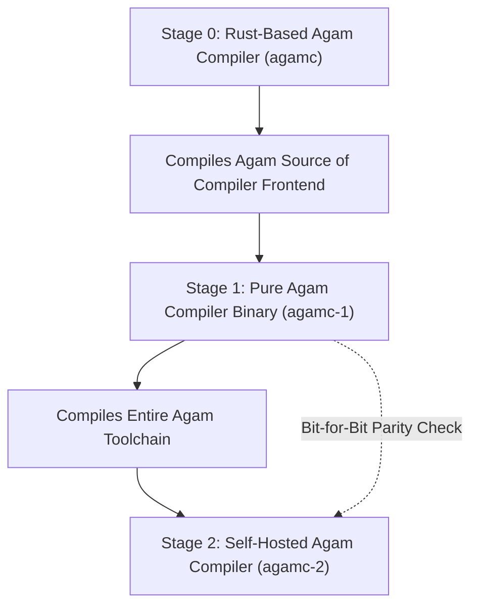

# Stage 7: Self-Hosting Bootstrap & 1:1 Benchmark Verification

**Stage**: `Stage 7 (Planned Execution)`  
**Domain**: Compiler Bootstrapping, Self-Hosting & Verified Benchmarks  
**Status**: **PLANNED**  

---

## 1. Executive Summary & Problem Definition

The ultimate proof of compiler correctness, performance, and maturity is self-hosting: compiling the Agam compiler using the Agam compiler itself, followed by verified, reproducible 1:1 benchmarks against standard native toolchains (C++ `clang++ -O3`, Rust `rustc --release`).

---

## 2. Technical Deliverables & Architecture

### 2.1 Full Self-Hosting Pipeline
- **Stage 0**: Host-native Rust compiler compiles Agam lexer, parser, SEMA, and codegen written in Agam.
- **Stage 1**: The emitted binary compiles the compiler codebase again to produce Stage 2.
- **Verification**: Verify bit-for-bit output identity between Stage 1 and Stage 2 compilation outputs.

### 2.2 Apples-to-Apples Differential Benchmarks
- Benchmark Agam against Clang `-O3` and Rust `release` on identical algorithmic kernels (Fibonacci, Sieve, Quicksort, 4K Image Sharpen, FLAC audio encode, HTTP flood).
- Publish transparent, non-synthetic performance dashboards.

---

## 3. Verification & Acceptance Criteria
- [ ] Complete Stage 0 $\rightarrow$ Stage 1 $\rightarrow$ Stage 2 self-hosting loop completes with 0 errors.
- [ ] Automated benchmark suite runs against C++ and Rust on identical input datasets.
- [ ] All benchmark results documented in `benchmarks/results/` with raw profiling traces.
