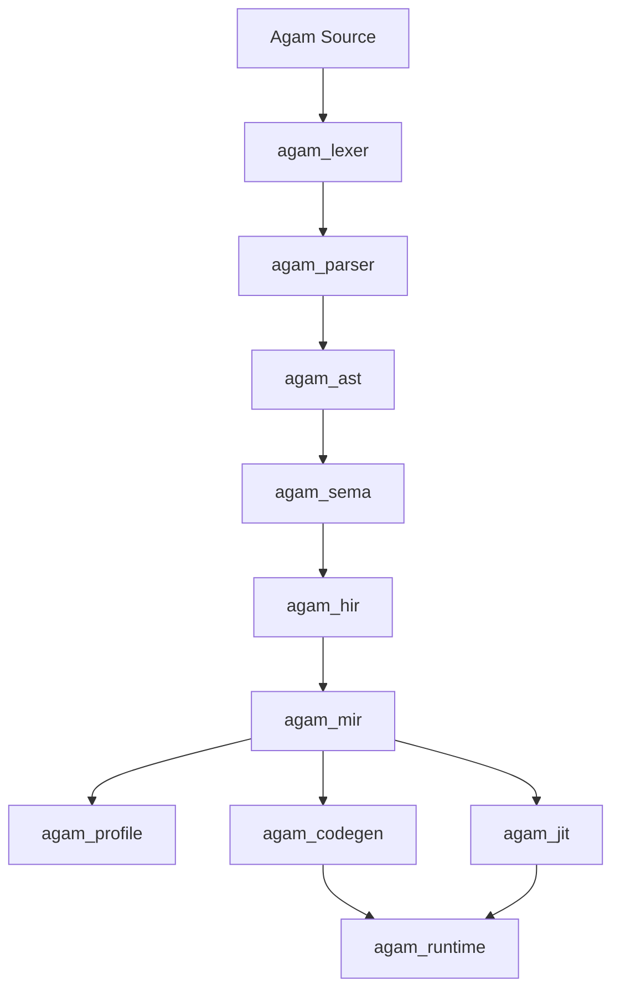

# Agam

Agam is a compiled language and toolchain implemented in Rust. The project goal is straightforward:

- keep Python-level readability for everyday code
- keep Rust-like safety and traceable compiler diagnostics
- reach clang++-class native performance on Agam's proven native workloads
- make AI, numerical, tensor, and data workflows language-native rather than wrapper-heavy library stories

Agam is its own language. It is not Python with different punctuation, and it is not a Rust macro layer.

## What Exists Today

Agam already has a real compiler pipeline and multiple execution paths:

- frontend crates for lexing, parsing, AST construction, semantic analysis, HIR, and MIR
- a C backend and a direct LLVM IR backend
- a Cranelift JIT for in-memory execution
- profiling and call-cache infrastructure for adaptive optimization work
- first-party CLI workflows such as `agamc new`, `agamc dev`, `agamc fmt`, `agamc doctor`, and `agamc package sdk`

The current product direction is native LLVM on Windows, Linux, and Android. WSL is a development and verification fallback, not the shipped backend story. macOS and iOS remain planned targets, but they are not validation-complete product targets yet.

## Current Status

| Area | Status |
| --- | --- |
| Frontend (`agam_lexer`, `agam_parser`, `agam_ast`) | Working |
| Semantic analysis and typed lowering (`agam_sema`, `agam_hir`, `agam_mir`) | Working |
| C backend | Working |
| LLVM backend | Active product path |
| Cranelift JIT | Working |
| Tooling (`agamc new/dev/fmt/doctor/cache status`) | Working first-party slice |
| SDK packaging | Partial but real |
| Native LLVM SDK bundles | In progress |
| Adaptive specialization and value profiling | In progress |

## Language Direction

Agam is trying to unify one coherent language across:

- systems programming and native application development
- automation and scripting
- AI, tensor, autodiff, and numerical computing
- cross-platform tooling and packaging
- future game, graphics, and GPU-oriented workflows

The design bias is to make those capabilities part of the language and runtime contract, not bolt-ons that only exist through foreign libraries.

## Syntax Modes

Agam currently supports multiple source styles through one pipeline:

- `@lang.base`
  - indentation-significant, Python-like readability
- `@lang.base.dynamic`
  - scripting-oriented mode with more dynamic binding behavior
- `@lang.advance`
  - brace-delimited, more explicit systems-style syntax

Example:

```agam
fn sum(limit: i64) -> i64:
    let total: i64 = 0
    let i: i64 = 0
    while i < limit:
        total = total + i
        i = i + 1
    return total

fn main() -> i32:
    if sum(10) == 45:
        return 0
    return 1
```

## Architecture



Core workspace areas:

- `crates/agam_lexer`, `crates/agam_parser`, `crates/agam_ast`
  - source parsing and syntax representation
- `crates/agam_sema`, `crates/agam_hir`, `crates/agam_mir`
  - semantic analysis, typed lowering, and optimization handoff
- `crates/agam_codegen`
  - C and LLVM IR emission
- `crates/agam_jit`
  - Cranelift-based in-memory execution
- `crates/agam_runtime`
  - runtime helpers, ARC, SIMD, cache, contract, and profiling glue
- `crates/agam_profile`
  - profiling models and optimization evidence
- `crates/agam_driver`
  - the `agamc` CLI
- `crates/agam_pkg`
  - package and SDK manifest support

## Getting Started

Build the CLI from source:

```bash
cargo build -p agam_driver
```

Or run the CLI through Cargo while developing:

```bash
cargo run -p agam_driver -- --help
```

Create a first-party project:

```bash
cargo run -p agam_driver -- new hello_agam
cd hello_agam
cargo run -p agam_driver -- dev
```

Work directly with a single source file:

```bash
cargo run -p agam_driver -- build examples/llvm_native_smoke.agam --fast
cargo run -p agam_driver -- run examples/llvm_native_smoke.agam --backend jit
```

## Main CLI Workflows

```bash
# Create a project
agamc new hello_agam

# Integrated local loop
agamc dev

# Format source
agamc fmt --check .

# Auto-select the best available backend at -O3
agamc build path/to/file.agam --fast
agamc run path/to/file.agam --fast

# Force a backend
agamc build path/to/file.agam --backend llvm -O 3
agamc run path/to/file.agam --backend jit

# Toolchain readiness
agamc doctor

# Inspect workspace cache state
agamc cache status

# Stage an SDK bundle
agamc package sdk
```

## Backends

| Backend | Purpose | Notes |
| --- | --- | --- |
| `auto` | Default path | Chooses the best available backend for the host/toolchain state |
| `llvm` | Native AOT path | Primary product direction |
| `jit` | Fast in-memory execution | Self-contained fallback for local execution |
| `c` | Portable fallback backend | Still useful, but no longer the only native path |

## Native LLVM Toolchain Story

Agam's native LLVM readiness is built around one supportable contract:

1. bundled LLVM beside `agamc`
2. Visual Studio Community 2026 LLVM on Windows
3. standard `C:\Program Files\LLVM`
4. explicit environment overrides
5. WSL LLVM only when explicitly enabled for development

Important platform rules:

- Windows, Linux, and Android are the active native LLVM targets
- WSL is not the shipped backend story
- Visual Studio Community 2026 is the canonical Windows-side host toolchain inventory
- Android sysroot and NDK support are part of the active direction
- macOS and iOS should not be claimed as supported product targets until native validation hardware is in hand

Useful environment hooks:

```bash
AGAM_LLVM_CLANG=clang++
AGAM_LLVM_BUNDLE_DIR=./toolchains/llvm
AGAM_LLVM_SYSROOT=/path/to/sysroot
AGAM_LLVM_TARGET_TRIPLE=x86_64-unknown-linux-gnu
```

## Optimization and Performance Direction

Agam's performance target is not "fast enough for a new language." The target is to compete with optimized `clang++` output on Agam's proven native workloads.

That comes with constraints:

- optimization work must be benchmark-driven
- compile-time or runtime regressions should be rejected, not rationalized
- Agam semantics must stay intact instead of leaning on C or C++ undefined behavior shortcuts
- spans, source IDs, and lowering traceability should survive the pipeline

Recent active work includes:

- call-cache profiling and adaptive admission
- stable-value profiling and specialization planning
- guarded specialization cloning on the JIT path
- first LLVM specialization-clone plumbing
- SDK packaging and doctor/readiness alignment

## What Works Today

Agam already includes:

- typed scalar lowering with explicit width/sign preservation
- direct LLVM IR emission from MIR
- native `clang` / `clang++` integration through `agamc`
- a Cranelift JIT execution path
- runtime helpers for process arguments and basic host interaction
- call-cache selection, bounded cache modes, and persisted optimization profiles
- formatter, workspace scaffolding, cache inspection, and SDK staging commands

## What Is Still In Progress

Agam is still under active compiler development. Important incomplete areas include:

- richer LLVM-side stable-value and reuse-distance profiling
- broader reversible specialization across all runtime/backend surfaces
- incremental daemon and deterministic parallel compilation
- final SDK bundle validation on hosted runners
- broader language-surface completion beyond the current proven subsets

## Roadmap Now

These are the active next phases from the repo's current program board:

1. Phase 15D: Value Profiling, Adaptive Admission, and Specialization
   - make measured payoff drive cache admission and specialization decisions
   - finish LLVM-side profiling and guarded specialization work
2. Phase 15F: Incremental Daemon, Background Prewarm, and Parallel Compilation
   - keep typed/lowered state warm across edits
   - parallelize independent work deterministically
3. Phase 15G: First-Party Premium Experience Layer
   - unify workspace, package, runtime, cache, and CLI conventions
4. Phase 15H: Native LLVM SDK Distribution and Toolchain Bundles
   - ship supportable Windows/Linux SDK outputs
   - extend Android target-pack validation

## Repository Layout

```text
crates/      compiler, runtime, tooling, packaging, and JIT crates
examples/    example Agam programs
scripts/     helper scripts for packaging and maintenance
.agent/      canonical project guidance, rules, and phase board
```

## Additional Documentation

- [`info.md`](./info.md)
  - concise architecture and program summary
- [`AGENTS.md`](./AGENTS.md)
  - agent entrypoint for repo-specific workflow
- [`.agent/`](./.agent/)
  - canonical project policy, phases, skills, and rules

## Development Notes

For backend and LLVM-adjacent work, the repo guidance is:

- use WSL Ubuntu 24.04 LTS for Linux and LLVM verification
- keep Git staging and commits on Windows
- prefer the smallest responsible crate
- run scoped `cargo fmt --check` and `cargo check`
- route compiler failures through `agam_errors`
- treat benchmark evidence as part of the implementation, not optional follow-up

Agam is building toward one language that can scale from scripting to systems work to AI-native native code without splitting the project into disconnected sub-languages. That is the point of the repository, and the LLVM/JIT/tooling work in this workspace is the current path toward it.
