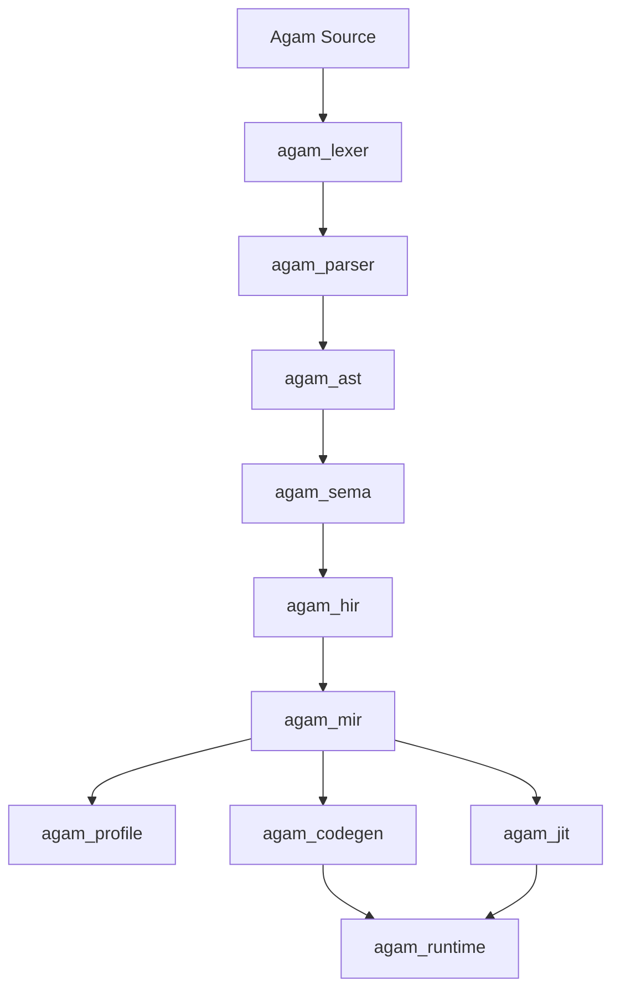
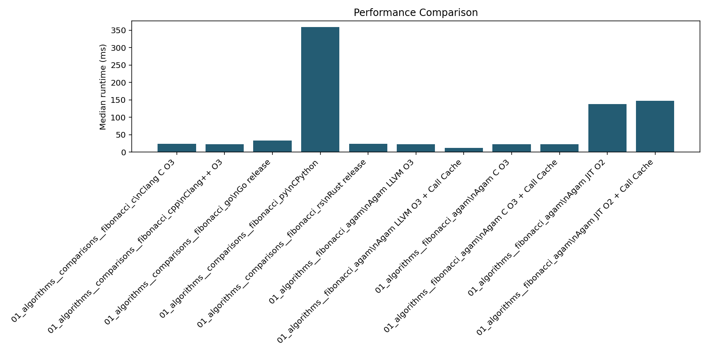
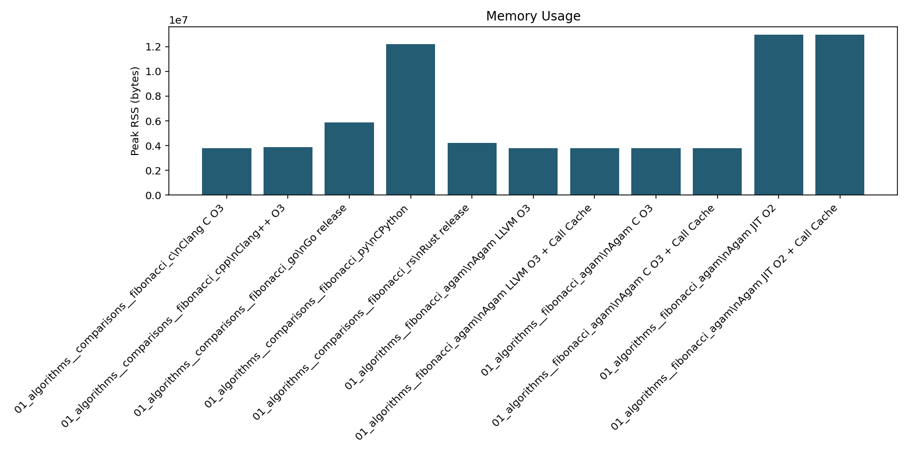
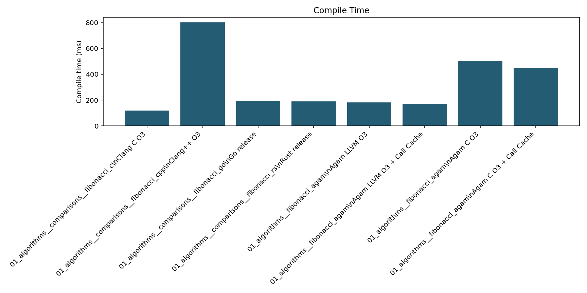
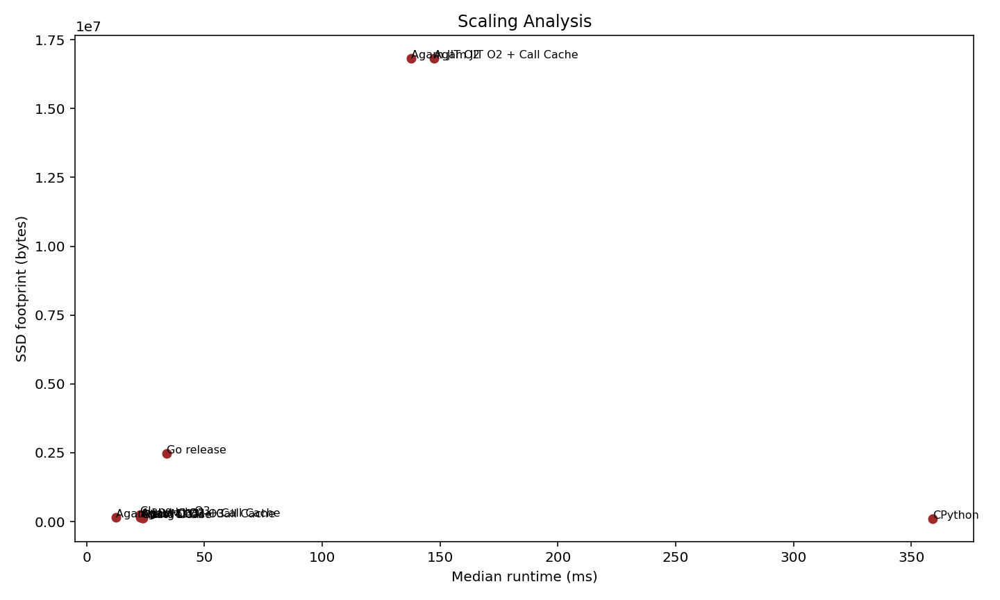

# Agam

Agam is a compiled language and toolchain implemented in Rust. The project goal is straightforward:

- keep Python-level readability for everyday code
- keep Rust-like safety and traceable compiler diagnostics
- reach clang++-class native performance on Agam's proven native workloads
- make AI, numerical, tensor, and data workflows language-native rather than wrapper-heavy library stories

Agam is its own language. It is not Python with different punctuation, and it is not a Rust macro layer.

## What Exists Today

Agam already has a real compiler pipeline and multiple execution paths:

- frontend crates for lexing, parsing, AST construction, semantic analysis, HIR, and MIR
- a C backend and a direct LLVM IR backend
- a Cranelift JIT for in-memory execution
- profiling and call-cache infrastructure for adaptive optimization work
- first-party CLI workflows such as `agamc new`, `agamc dev`, `agamc fmt`, `agamc doctor`, and `agamc package sdk`

The current product direction is native LLVM on Windows, Linux, and Android. WSL is a development and verification fallback, not the shipped backend story. macOS and iOS remain planned targets, but they are not validation-complete product targets yet.

## Current Status

| Area | Status |
| --- | --- |
| Frontend (`agam_lexer`, `agam_parser`, `agam_ast`) | Working |
| Semantic analysis and typed lowering (`agam_sema`, `agam_hir`, `agam_mir`) | Working |
| C backend | Working |
| LLVM backend | Active product path |
| Cranelift JIT | Working |
| Tooling (`agamc new/dev/fmt/doctor/cache status`) | Working first-party slice |
| SDK packaging | Partial but real |
| Native LLVM SDK bundles | In progress |
| Adaptive specialization and value profiling | In progress |

## Language Direction

Agam is trying to unify one coherent language across:

- systems programming and native application development
- automation and scripting
- AI, tensor, autodiff, and numerical computing
- cross-platform tooling and packaging
- future game, graphics, and GPU-oriented workflows

The design bias is to make those capabilities part of the language and runtime contract, not bolt-ons that only exist through foreign libraries.

## Syntax Modes

Agam currently supports multiple source styles through one pipeline:

- `@lang.base`
  - indentation-significant, Python-like readability
- `@lang.base.dynamic`
  - scripting-oriented mode with more dynamic binding behavior
- `@lang.advance`
  - brace-delimited, more explicit systems-style syntax

Example:

```agam
fn sum(limit: i64) -> i64:
    let total: i64 = 0
    let i: i64 = 0
    while i < limit:
        total = total + i
        i = i + 1
    return total

fn main() -> i32:
    if sum(10) == 45:
        return 0
    return 1
```

## Architecture



Core workspace areas:

- `crates/agam_lexer`, `crates/agam_parser`, `crates/agam_ast`
  - source parsing and syntax representation
- `crates/agam_sema`, `crates/agam_hir`, `crates/agam_mir`
  - semantic analysis, typed lowering, and optimization handoff
- `crates/agam_codegen`
  - C and LLVM IR emission
- `crates/agam_jit`
  - Cranelift-based in-memory execution
- `crates/agam_runtime`
  - runtime helpers, ARC, SIMD, cache, contract, and profiling glue
- `crates/agam_profile`
  - profiling models and optimization evidence
- `crates/agam_driver`
  - the `agamc` CLI
- `crates/agam_pkg`
  - portable package, SDK manifest, and future source-package/environment management

## Getting Started

Build the CLI from source:

```bash
cargo build -p agam_driver
```

Or run the CLI through Cargo while developing:

```bash
cargo run -p agam_driver -- --help
```

Create a first-party project:

```bash
cargo run -p agam_driver -- new hello_agam
cd hello_agam
cargo run -p agam_driver -- dev
```

Work directly with a single source file:

```bash
cargo run -p agam_driver -- build examples/llvm_native_smoke.agam --fast
cargo run -p agam_driver -- run examples/llvm_native_smoke.agam --backend jit
```

## Main CLI Workflows

```bash
# Create a project
agamc new hello_agam

# Integrated local loop
agamc dev

# Format source
agamc fmt --check .

# Auto-select the best available backend at -O3
agamc build path/to/file.agam --fast
agamc run path/to/file.agam --fast

# Force a backend
agamc build path/to/file.agam --backend llvm -O 3
agamc run path/to/file.agam --backend jit

# Toolchain readiness
agamc doctor

# Inspect workspace cache state
agamc cache status

# Stage an SDK bundle
agamc package sdk
```

## Backends

| Backend | Purpose | Notes |
| --- | --- | --- |
| `auto` | Default path | Chooses the best available backend for the host/toolchain state |
| `llvm` | Native AOT path | Primary product direction |
| `jit` | Fast in-memory execution | Self-contained fallback for local execution |
| `c` | Portable fallback backend | Still useful, but no longer the only native path |

## Native LLVM Toolchain Story

Agam's native LLVM readiness is built around one supportable contract:

1. bundled LLVM beside `agamc`
2. Visual Studio Community 2026 LLVM on Windows
3. standard `C:\Program Files\LLVM`
4. explicit environment overrides
5. WSL LLVM only when explicitly enabled for development

Important platform rules:

- Windows, Linux, and Android are the active native LLVM targets
- WSL is not the shipped backend story
- Visual Studio Community 2026 is the canonical Windows-side host toolchain inventory
- Android sysroot and NDK support are part of the active direction
- macOS and iOS should not be claimed as supported product targets until native validation hardware is in hand

Useful environment hooks:

```bash
AGAM_LLVM_CLANG=clang++
AGAM_LLVM_BUNDLE_DIR=./toolchains/llvm
AGAM_LLVM_SYSROOT=/path/to/sysroot
AGAM_LLVM_TARGET_TRIPLE=x86_64-unknown-linux-gnu
```

## Optimization and Performance Direction

Agam's performance target is not "fast enough for a new language." The target is to compete with optimized `clang++` output on Agam's proven native workloads.

That comes with constraints:

- optimization work must be benchmark-driven
- compile-time or runtime regressions should be rejected, not rationalized
- Agam semantics must stay intact instead of leaning on C or C++ undefined behavior shortcuts
- spans, source IDs, and lowering traceability should survive the pipeline

Recent active work includes:

- call-cache profiling and adaptive admission
- stable-value profiling and specialization planning
- guarded specialization cloning on the JIT path
- first LLVM specialization-clone plumbing
- SDK packaging and doctor/readiness alignment

## What Works Today

Agam already includes:

- typed scalar lowering with explicit width/sign preservation
- direct LLVM IR emission from MIR
- native `clang` / `clang++` integration through `agamc`
- a Cranelift JIT execution path
- runtime helpers for process arguments and basic host interaction
- call-cache selection, bounded cache modes, and persisted optimization profiles
- formatter, workspace scaffolding, cache inspection, and SDK staging commands

## What Is Still In Progress

Agam is still under active compiler development. Important incomplete areas include:

- richer LLVM-side stable-value and reuse-distance profiling
- broader reversible specialization across all runtime/backend surfaces
- incremental daemon and deterministic parallel compilation
- final SDK bundle validation on hosted runners
- broader language-surface completion beyond the current proven subsets

## Roadmap Now

These are the active next phases from the repo's current program board:

1. Phase 15F: Incremental Daemon, Background Prewarm, and Parallel Compilation
   - keep typed/lowered state warm across edits
   - parallelize independent work deterministically
2. Phase 15G: First-Party Premium Experience Layer
   - unify workspace, package, runtime, cache, and CLI conventions
3. Phase 15H: Native LLVM SDK Distribution and Toolchain Bundles
   - ship supportable Windows/Linux SDK outputs
   - extend Android target-pack validation

After those core LLVM, daemon, and SDK slices, the next package-ecosystem priorities are:

1. Phase 17A: workspace contract and dependency manifests
2. Phase 17B: deterministic resolver and `agam.lock`
3. Phase 17C: registry index and publish protocol
4. Phase 17D: named environments and SDK linking
5. Phase 17E: first-party base distributions and official package governance
6. Phase 17F: standard-library growth on top of the new package ecosystem

## Repository Layout

```text
crates/      compiler, runtime, tooling, packaging, and JIT crates
examples/    example Agam programs
scripts/     helper scripts for packaging and maintenance
.agent/      canonical project guidance, rules, and phase board
```

## Additional Documentation

- [`info.md`](./info.md)
  - concise architecture and program summary
- [`.agent/policy/package-ecosystem.md`](./.agent/policy/package-ecosystem.md)
  - canonical package, registry, lockfile, environment, and first-party distribution direction
- [`AGENTS.md`](./AGENTS.md)
  - agent entrypoint for repo-specific workflow
- [`.agent/`](./.agent/)
  - canonical project policy, phases, skills, and rules

## Development Notes

For backend and LLVM-adjacent work, the repo guidance is:

- use WSL Ubuntu 24.04 LTS for Linux and LLVM verification
- keep Git staging and commits on Windows
- prefer the smallest responsible crate
- run scoped `cargo fmt --check` and `cargo check`
- route compiler failures through `agam_errors`
- treat benchmark evidence as part of the implementation, not optional follow-up

Agam is building toward one language that can scale from scripting to systems work to AI-native native code without splitting the project into disconnected sub-languages. That is the point of the repository, and the LLVM/JIT/tooling work in this workspace is the current path toward it.

## How To Code With Agam: Complete Guide A-Z

This section is a repo-grounded guide to the Agam surface that is actually present in this workspace today. It is intentionally based on `examples/`, `benchmarks/benchmarks/`, `.agent/test/`, and the compiler/runtime crates instead of on future language ideas.

### 1. Pick A Source Mode First

Agam currently supports three source styles:

| Mode | When To Use It | Example |
| --- | --- | --- |
| `@lang.base` | indentation-significant, readable application code | [`examples/hello_base.agam`](./examples/hello_base.agam) |
| `@lang.base.dynamic` | scripting-oriented workflows with lighter binding syntax | [`examples/hello_base_dynamic.agam`](./examples/hello_base_dynamic.agam) |
| `@lang.advance` | brace-delimited, explicit native-style code | [`examples/hello_advance.agam`](./examples/hello_advance.agam) |

If you are unsure, start with `@lang.base` for readability or `@lang.advance` when you want the same explicit style used by most backend, benchmark, and LLVM-native examples.

### 2. Start With A Small Runnable File

Base mode:

```agam
@lang.base
fn main():
    let total = 40 + 2
    if total == 42:
        return 0
    return 1
```

Advance mode:

```agam
@lang.advance
fn main() -> i32 {
    let total: i32 = 40 + 2;
    if total == 42 {
        return 0;
    }
    return 1;
}
```

The current repo examples typically use an integer `main` that returns `0` on success.

### 3. Use The Standard Local Development Loop

For day-to-day work, the current first-party loop is:

```bash
agamc fmt --check path/to/file.agam
agamc check path/to/file.agam
agamc run path/to/file.agam --backend jit
agamc build path/to/file.agam --fast
```

If you are working in a project directory created by `agamc new`, the integrated loop is:

```bash
agamc dev
```

### 4. Organize Code Around Functions And Imports

The current Agam examples are function-oriented. A typical file:

- selects a language mode with `@lang.*`
- imports standard modules when needed
- defines helper functions first
- defines `main` last

Example from the benchmark sources:

```agam
@lang.advance

import agam_std.numerical
import agam_std.ndarray
import agam_std.dataframe

fn main() -> i32 {
    return 0;
}
```

### 5. Write Typed Native Loops For Hot Paths

The repo's benchmark and backend work assumes direct loops and explicit scalar types on hot paths. This is the current style Agam optimizes around:

```agam
@lang.advance
fn hot(n: i64) -> i64 {
    let total: i64 = 0;
    let i: i64 = 0;
    while i < n {
        total = total + i;
        i = i + 1;
    }
    return total;
}
```

### 6. Use Tests As Plain Agam Code

Current repo tests can live in `.agam` files with `@test` annotations:

```agam
@test
fn arithmetic_is_sound() -> bool:
    return (20 + 22) == 42
```

See [`examples/smoke_tests.agam`](./examples/smoke_tests.agam) for the current test-shaped syntax.

### 7. Choose The Right Backend For The Job

- use `--backend jit` for quick local execution
- use `--backend llvm` for the primary native product path
- use `--fast` when you want the best currently available optimized path without choosing manually
- use `agamc doctor` when LLVM readiness is unclear

### 8. Keep Current Limits In Mind

Agam is real and runnable today, but it is still under active compiler development. The safest way to write believable Agam code is:

- follow the examples already in `examples/`, `benchmarks/benchmarks/`, and `.agent/test/`
- prefer the language constructs already proven by the parser, MIR, JIT, and LLVM paths
- treat not-yet-documented or not-yet-exampled surface area as in progress rather than assumed

## Benchmark Workspace

The organized benchmark workspace now lives under `benchmarks/`:

- `benchmarks/benchmarks/`
  - categorized Agam and comparison-language suites
- `benchmarks/infrastructure/` and `benchmarks/harness/`
  - discovery, execution, profiling, statistics, and language runners
- `benchmarks/ci/`
  - baseline management, regression detection, and `gh` workflow helpers
- `benchmarks/METHODOLOGY.md`
  - the measurement contract for runtime, compile time, memory, baselines, and reporting

Use `.agent/test/` for narrow phase-work microbenchmarks and generated inspection artifacts tied to active optimization slices.

### Same-Host Comparison Snapshot

The current published snapshot was captured on `2026-04-02` from one `benchmark_harness` invocation on the same Win11 host and environment profile: `local_windows_win11` (`Windows-11-10.0.26200-SP0`, AMD64, 8 physical cores / 16 logical cores). Every row below ran the same `01_algorithms/fibonacci` workload with `--match fibonacci`, runtime warmups `2`, measured runs `7`, and compile warmup runs `1`.

Agam targets in this snapshot were launched through the built `agamc` binary instead of `cargo run`, so Cargo startup did not contaminate runtime or compile-time measurements. The Agam C backend path also compiled the emitted C to a native executable before timing runtime, so the runtime rows stay like-for-like with Clang/Rust/Go native binaries.

```bash
python -m benchmarks.infrastructure.benchmark_harness \
  --environment local_windows_win11 \
  --suite 01_algorithms \
  --match fibonacci \
  --include-comparisons \
  --target agam_llvm_o3_call_cache_off \
  --target agam_llvm_o3_call_cache_on \
  --target agam_c_o3_call_cache_off \
  --target agam_c_o3_call_cache_on \
  --target agam_jit_o2_call_cache_off \
  --target agam_jit_o2_call_cache_on \
  --target rust_release \
  --target python_cpython \
  --target c_clang_o3 \
  --target cpp_clangxx_o3 \
  --target go_release \
  --warmups 2 \
  --runs 7
```

All rows in this snapshot measure the same recursive Fibonacci shape: time complexity `O(phi^n)` and space complexity `O(n)`.

| Target | Backend | Runtime median (ms) | Compile time (ms) | SSD footprint | Peak RSS |
| --- | --- | ---: | ---: | ---: | ---: |
| Agam LLVM O3 | LLVM | 22.805 | 183.0 | 150.50 KiB | 3.63 MiB |
| Agam LLVM O3 + Call Cache | LLVM | 12.482 | 173.0 | 150.50 KiB | 3.63 MiB |
| Agam C O3 | C | 23.287 | 505.7 | 163.50 KiB | 3.62 MiB |
| Agam C O3 + Call Cache | C | 23.327 | 450.0 | 163.50 KiB | 3.62 MiB |
| Agam JIT O2 | JIT | 137.818 | n/a | 16.04 MiB | 12.36 MiB |
| Agam JIT O2 + Call Cache | JIT | 147.551 | n/a | 16.04 MiB | 12.36 MiB |
| Clang++ O3 | native | 22.753 | 801.0 | 257.00 KiB | 3.69 MiB |
| Clang C O3 | native | 23.479 | 118.3 | 135.00 KiB | 3.61 MiB |
| Rust release | native | 23.800 | 190.2 | 126.00 KiB | 4.02 MiB |
| Go release | native | 33.822 | 192.9 | 2.35 MiB | 5.61 MiB |
| CPython | interpreted | 359.203 | n/a | 101.96 KiB | 11.66 MiB |

On this specific recursive workload, LLVM plus call cache is the fastest Agam configuration in the current snapshot. Agam LLVM without call cache lands in the same runtime range as the C, C++, and Rust native comparison targets on the same host.

Cache and register columns still exist in the raw benchmark outputs, but they are host-capacity context rather than exact live L3 occupancy or exact register allocation counts. If you need precise cache-miss or register-pressure counters, add platform-specific perf tooling on top of this workspace.

### Published Plots

The generated raw plots live under `benchmarks/results/plots/`; the checked-in snapshots below are copied from the latest same-host run so the README always shows concrete output instead of a schematic placeholder.









## Agam Syntax For Development: Complete Guide A-Z

This syntax guide is intentionally grounded in the current repo examples and parser-facing code. It documents the surface that is already visible in this workspace.

### File Directives And Annotations

- `@lang.base`
  selects indentation-significant base mode
- `@lang.base.dynamic`
  selects scripting-oriented dynamic base mode
- `@lang.advance`
  selects brace-delimited advanced mode
- `@test`
  marks test-oriented functions/files used by the current testing flow
- experimental annotations such as `@experimental.call_cache.optimize`
  exist for optimization work and should stay local to hot-path experiments

### Comments

- base-mode examples use `#`
- advance-mode examples use `//`

### Functions

Base mode:

```agam
fn add(a: i64, b: i64) -> i64:
    return a + b
```

Advance mode:

```agam
fn add(a: i64, b: i64) -> i64 {
    return a + b;
}
```

### Variables And Bindings

Current repo examples show:

- explicit bindings with `let`
- type annotations such as `let total: i64 = 0`
- dynamic-style assignments without `let` in `@lang.base.dynamic`
- reassignment in loops and accumulators
- `let mut` in some `@lang.advance` examples, but not as the only style used in the repo

Examples:

```agam
let total: i64 = 0
let i: i64 = 0
total = total + 1
```

```agam
let mut total: i32 = 0;
total += 1;
```

### Conditionals

Base mode:

```agam
if total == 42:
    return 0
return 1
```

Advance mode:

```agam
if total == 42 {
    return 0;
}
return 1;
```

### Loops

Current repo-grounded loop forms include `while` and `for`.

`while`:

```agam
let i: i64 = 0
while i < limit:
    i = i + 1
```

`for`:

```agam
for score in scores {
    total += score;
}
```

### Types

Current examples show:

- signed integers such as `i32` and `i64`
- floating-point values such as `f64`
- `bool`
- `String`
- generic arrays such as `Array<i32>` and `Array<f64>`

Example:

```agam
let name: String = "World";
let scores: Array<i32> = [90, 85, 72, 95];
```

### Literals And Operators

The repo examples use:

- integer literals: `0`, `42`, `30000000`
- floating-point literals: `0.001`, `0.1`, `0.00000001`
- string literals: `"World"`
- array literals: `[90, 85, 72, 95]`
- arithmetic operators: `+`, `-`, `*`, `/`, `%`
- comparison operators: `==`, `!=`, `<`, `<=`, `>=`, `>`

### Strings And Printing

Current examples show both direct concatenation and formatted printing:

```agam
println("Hello, " + name + "!");
println("Average score: {}", avg);
print_int(acc);
```

Base-mode examples also show formatted-string syntax:

```agam
print(f"Average score: {avg}")
```

### Imports And Standard Modules

Current repo examples import standard modules like this:

```agam
import agam_std.numerical
import agam_std.ndarray
import agam_std.dataframe
```

### Indexing, Method Calls, And Field-Style Access

The current examples show:

- indexing: `x[0]`
- method-style calls: `scores.len()`, `map(...)`, `filter(...)`
- field-style access in closures such as `row.score`

### Closures

Advance-mode examples show closure syntax like:

```agam
let grad_f = |x: Array<f64>| -> Array<f64> {
    let dx: f64 = -2.0 * (1.0 - x[0]);
    return [dx];
};
```

### Process Arguments And Host Helpers

The current runtime-facing examples show:

```agam
if argc() > index {
    return parse_int(argv(index));
}
```

### Complete Repo-Grounded Syntax Example

```agam
@lang.advance

fn arg_or(index: i32, fallback: i64) -> i64 {
    if argc() > index {
        return parse_int(argv(index));
    }
    return fallback;
}

fn main() -> i32 {
    let input: i64 = arg_or(1, 33);
    let acc: i64 = 0;
    let i: i64 = 0;
    while i < 8 {
        acc = acc + input + i;
        i = i + 1;
    }
    print_int(acc);
    return 0;
}
```

## Features

Agam's current repo-visible features include:

- multiple language modes through one compiler pipeline
- a real frontend stack: lexer, parser, AST, semantic analysis, HIR, and MIR
- direct LLVM IR emission
- a C backend
- a Cranelift JIT
- native runtime helpers for arguments, printing, ARC, SIMD, and host-facing support
- call-cache profiling, adaptive admission, and guarded specialization work
- persisted optimization and specialization planning
- first-party CLI workflows: `new`, `dev`, `fmt`, `doctor`, `cache status`, `package sdk`
- standard-library-facing work for numerical, tensor, dataframe, and ML-oriented code paths
- SDK packaging and host-toolchain discovery for the native LLVM direction

Important feature-status note:

- some of these surfaces are already working end to end
- some are partially complete but real
- some are still active compiler-development areas rather than finished product contracts

The earlier "Current Status", "What Works Today", and "What Is Still In Progress" sections remain the authority for readiness.

## How Agam Works: Complete Guide A-Z

The short version is: you write `.agam` source, `agamc` lowers it through several internal compiler layers, then it either executes through the JIT or emits native code through the C or LLVM backends.

### 1. Source And Mode Selection

Your file starts by selecting a language mode such as `@lang.base` or `@lang.advance`. That controls the parser-facing surface style, but the source still enters one compiler pipeline.

### 2. Lexing

`agam_lexer` converts source text into tokens. This is where punctuation, keywords, indentation-sensitive structure, and literals first become compiler data.

### 3. Parsing And AST Construction

`agam_parser` and `agam_ast` build the syntax tree for the file. At this stage, Agam structure is explicit enough for diagnostics and later semantic work.

### 4. Semantic Analysis

`agam_sema` performs typing and semantic checks. This is where the compiler validates meaning rather than just surface syntax.

### 5. Typed Lowering

`agam_hir` and `agam_mir` lower the program into the compiler's typed internal forms. MIR is the main optimization and backend handoff layer in the current workspace.

### 6. Optimization And Profiling Hooks

From MIR, Agam can:

- optimize code structurally
- attach profiling-sensitive behavior
- prepare adaptive decisions such as call-cache selection and specialization planning

The profiling side is modeled in `agam_profile`, and the runtime helpers needed by execution live in `agam_runtime`.

### 7. Execution Paths

Agam currently has three real execution/codegen paths:

- `agam_jit`
  uses Cranelift for in-memory execution
- `agam_codegen` C backend
  emits portable C for a fallback native path
- `agam_codegen` LLVM backend
  emits LLVM IR for the primary native product direction

### 8. Runtime Support

Regardless of backend, generated code relies on runtime support for things like:

- process arguments
- printing and host helpers
- ARC and memory/runtime glue
- SIMD-oriented support
- call-cache and profiling surfaces

### 9. Adaptive Optimization Feedback

Agam is not only a static frontend. The current optimization direction already includes:

- runtime call-cache profiling
- stable-value tracking
- reuse-distance tracking
- guarded specialization
- persisted profiles that can influence later optimize/specialization decisions

That is why the repo has both `agam_profile` and backend-specific specialization/cache code instead of a single one-shot codegen layer.

### 10. The CLI Layer

`agamc` in `crates/agam_driver` orchestrates the whole flow:

- reads source files or project layouts
- chooses a backend
- checks toolchain readiness
- runs formatter/test/dev/package flows
- loads and stores persisted optimization evidence when that path is enabled

### 11. The Current Direction

The repository is converging on one supportable contract:

- native LLVM for Windows, Linux, and Android as the primary compiled path
- JIT as the fast local/in-memory execution path
- profiling-backed optimization decisions instead of fixed heuristic guesses
- first-party tooling and SDK packaging instead of ad hoc setup stories

### 12. The Honest State Of The Project

Agam already works as a real language and toolchain, but it is still in active compiler development. The correct way to understand "how it works" today is:

- the pipeline is real
- the backends are real
- the tooling is real
- the optimization system is real but still evolving
- the full long-term language surface is larger than the currently proven subset

That is why the best practical guide is always: read the current `examples/`, use the current `agamc` workflows, and keep performance claims tied to the current profiling and backend reality in this repo.
