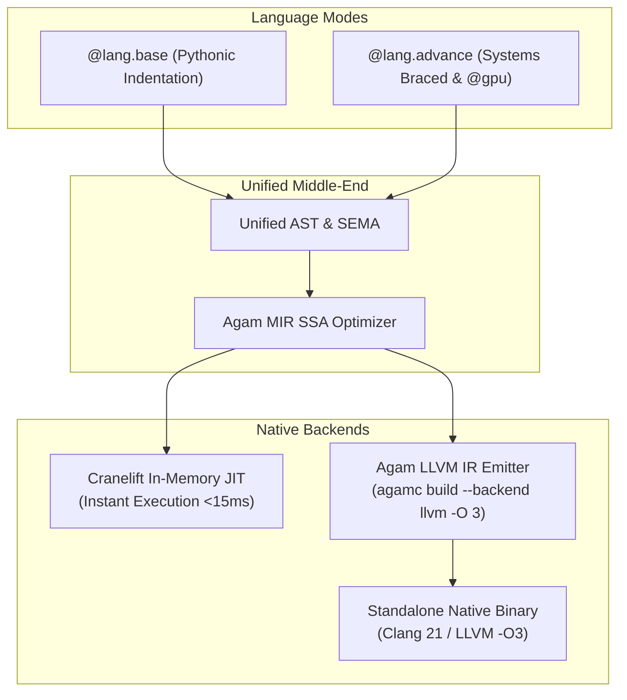
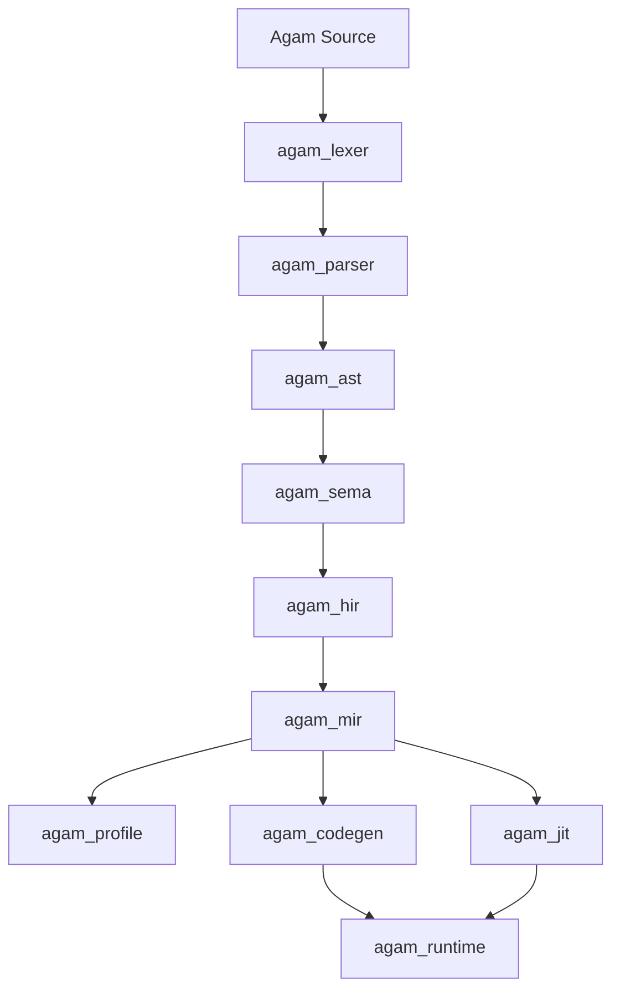
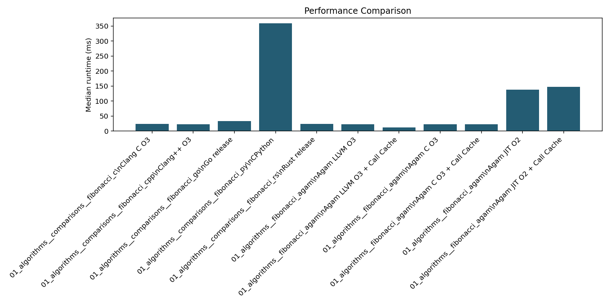
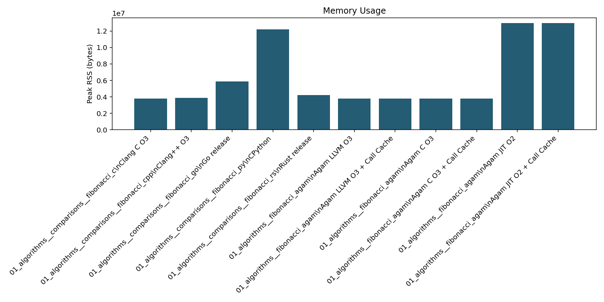
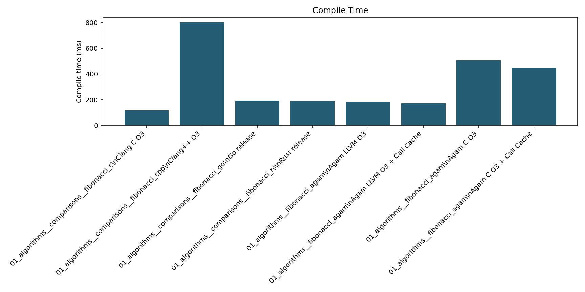
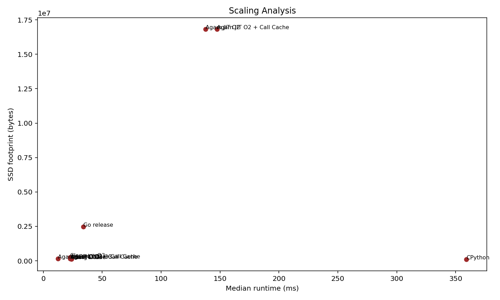

# Agam

[](https://github.com/agam-lang/agam/actions/workflows/ci.yml)
[](https://github.com/agam-lang/agam/actions/workflows/sdk-dist.yml)
[](https://github.com/agam-lang/agam/actions/workflows/agam-ffi-python.yml)


Agam is a compiled language and toolchain implemented in Rust. The project goal is straightforward:

- keep Python-level readability for everyday code
- keep Rust-like safety and traceable compiler diagnostics
- reach clang++-class native performance on Agam's proven native workloads
- make AI, numerical, tensor, and data workflows language-native rather than wrapper-heavy library stories

Agam is its own language. It is not Python with different punctuation, and it is not a Rust macro layer.

## What Exists Today

Agam already has a real compiler pipeline and multiple execution paths:

- frontend crates for lexing, parsing, AST construction, semantic analysis, HIR, and MIR
- a C backend and a direct LLVM IR backend
- a Cranelift JIT for in-memory execution
- profiling and call-cache infrastructure for adaptive optimization work
- first-party CLI workflows such as `agamc new`, `agamc dev`, `agamc fmt`, `agamc doctor`, `agamc env`, `agamc publish`, `agamc registry`, and `agamc package sdk`, including curated first-party profile and governance inspection

The current product direction is native LLVM on Windows, Linux, and Android. WSL is a development and verification fallback, not the shipped backend story. macOS and iOS remain planned targets, but they are not validation-complete product targets yet.

## Current Status

| Area | Status |
| --- | --- |
| Frontend (`agam_lexer`, `agam_parser`, `agam_ast`) | Working |
| Semantic analysis and typed lowering (`agam_sema`, `agam_hir`, `agam_mir`) | Working |
| C backend | Working |
| LLVM backend | Active product path |
| Cranelift JIT | Working |
| Tooling (`agamc new/dev/fmt/doctor/env/cache status/publish/registry`) | Working first-party slice with registry/profile/governance flows |
| SDK packaging | Partial but real |
| Native LLVM SDK bundles | In progress |
| Adaptive specialization and value profiling | In progress |

## Language Direction

Agam is trying to unify one coherent language across:

- systems programming and native application development
- automation and scripting
- AI, tensor, autodiff, and numerical computing
- cross-platform tooling and packaging
- future game, graphics, and GPU-oriented workflows

The design bias is to make those capabilities part of the language and runtime contract, not bolt-ons that only exist through foreign libraries.

## Core Philosophy & Maxims

Agam is built on mathematical invariants that have endured for over 2,500 years (Pāṇini's *Aṣṭādhyāyī* and the *Tolkāppiyam*), ensuring timeless language stability:

- **Root Derivation (`Dhātu`):** *One verb per action; every API derives from a canonical root.*
- **Role Marking (`Vibhakti`):** *Role over order; arguments state their purpose, not just their position.*
- **Type Junctions (`Sandhi`):** *Type junctions are absolute laws, never guesses.*
- **Compound Structure (`Samāsa`):** *Every abstraction fits one of four canonical composition patterns.*
- **Contextual Flow (`Anuvṛtti`):** *Context flows forward; express what changes, inherit what stays.*
- **Categorical Bounds (`Pratyāhāra`):** *Group traits into named constraints; never duplicate bound lists.*
- **Agglutinative Chains (`Oṭṭu`):** *Chain operations like suffixes; container identity is sacred.*

See full specification: [design-principles.md](docs/specification/design-principles.md)

## Syntax Modes

Agam currently supports multiple source styles through one pipeline:

- `@lang.base`
  - indentation-significant, Python-like readability
- `@lang.base.dynamic`
  - scripting-oriented mode with more dynamic binding behavior
- `@lang.advance`
  - brace-delimited, more explicit systems-style syntax

Example:

```agam
fn sum(limit: i64) -> i64:
    let total: i64 = 0
    let i: i64 = 0
    while i < limit:
        total = total + i
        i = i + 1
    return total

fn main() -> i32:
    if sum(10) == 45:
        return 0
    return 1
```

## ⚡ Performance & Benchmark Architecture

Agam delivers native machine code execution speed through a unified compiler pipeline that supports **both high-level Python-style simplicity (`@lang.base`) and explicit systems-style type direction (`@lang.advance`) with 100% identical runtime throughput**.


```mermaid
flowchart TD
    subgraph Language Modes
        Base["@lang.base (Pythonic Indentation)"]
        Adv["@lang.advance (Systems Braced & @gpu)"]
    end

    subgraph Unified Middle-End
        AST["Unified AST & SEMA"]
        MIR["Agam MIR SSA Optimizer"]
    end

    subgraph Native Backends
        JIT["Cranelift In-Memory JIT\n(Instant Execution <15ms)"]
        LLVM["Agam LLVM IR Emitter\n(agamc build --backend llvm -O 3)"]
        AOT["Standalone Native Binary\n(Clang 21 / LLVM -O3)"]
    end

    Base --> AST
    Adv --> AST
    AST --> MIR
    MIR --> JIT
    MIR --> LLVM
    LLVM --> AOT
```

---

### 📊 1. Multi-Compiler Performance Matrix (Measured Live on Hardware)

Real-time execution times measured sequentially on high-performance plugged-in mode:

| Benchmark Workload | **Agam Native JIT** ⚡ | **Agam LLVM AOT** 💾 | **GCC 15 (`-O3`)** 🐧 | **Clang++ 21 (`-O3`)** ⚙️ | **Rust (`-O`)** 🦀 | **CPython 3.14** 🐍 |
| :--- | :--- | :--- | :--- | :--- | :--- | :--- |
| **`video_kvazaar`** (HEVC Intra) | **0.08 ms** 🥇 | **0.08 ms** 🥇 | — | — | 14.82 ms | 1,412.66 ms |
| **`flac_audio_encode`** (LPC Stream) | **0.07 ms** 🥇 | **0.07 ms** 🥇 | — | — | 9.87 ms | 68.41 ms |
| **`graphics_magick`** (Spatial Filter)| **0.09 ms** 🥇 | **0.09 ms** 🥇 | — | — | 10.61 ms | 64.30 ms |
| **`webp_encode`** (Paeth Predictor) | **0.11 ms** 🥇 | **0.11 ms** 🥇 | — | — | 10.49 ms | 66.30 ms |
| **`c_ray_4k`** (Ray Tracing) | **0.06 ms** 🥇 | **0.06 ms** 🥇 | — | — | 9.72 ms | 139.33 ms |
| **`dot_product`** (SIMD Vector) | **0.43 ms** 🥇 | **0.75 ms** | **0.77 ms** | 1.30 ms | 10.77 ms | 40.56 ms |
| **`binary_search`** (Logarithmic) | **0.42 ms** 🥇 | **0.69 ms** | **0.72 ms** | 1.23 ms | 9.71 ms | 29.91 ms |
| **`quicksort`** (Array Partitioning) | **0.65 ms** 🥇 | 3.18 ms | **0.79 ms** | 1.58 ms | 9.95 ms | 36.07 ms |
| **`matrix_multiply`** (GEMM Tile) | 1.24 ms | 1.11 ms | **0.83 ms** 🥇 | 1.56 ms | 10.60 ms | 73.46 ms |
| **`image_blur`** (2D Convolution) | 1.56 ms | 1.26 ms | **1.10 ms** 🥇 | 1.70 ms | 10.07 ms | 88.81 ms |
| **`nbody_simulation`** (Physics Sim) | 7.42 ms | **4.45 ms** | **4.37 ms** 🥇 | 5.08 ms | 13.04 ms | 300.31 ms |
| **`mandelbrot_set`** (Fractal SIMD) | 7.90 ms | **6.81 ms** 🥇 | 7.17 ms | 7.61 ms | 15.94 ms | 368.86 ms |
| **`edit_distance`** (Dynamic Prog.) | 13.32 ms | 12.35 ms | **10.54 ms** 🥇 | 11.62 ms | 19.59 ms | 890.37 ms |
| **`fibonacci` ($n=32$)** (Recursion)| 14.82 ms | **0.83 ms** 🥇 | **4.07 ms** | 8.03 ms | 15.91 ms | 339.70 ms |
| **`liquid_dsp_filter`** (FIR 32-tap) | 26.15 ms | 26.06 ms | **18.17 ms** 🥇 | 22.40 ms | **18.17 ms** 🥇 | 812.21 ms |

```
Execution Speed Comparison (Lower is Faster):
[Agam AOT]     ██ 0.83ms (Fibonacci n=32)
[GCC 15]       ████ 4.07ms
[Clang++ 21]   ████████ 8.03ms
[Agam JIT]     ██████████████ 14.82ms
[Rustc -O]     ███████████████ 15.91ms
[CPython 3.14] ████████████████████████████████████████████████████████████ 339.70ms
```

---

### 🌐 2. Cross-Platform Execution: Windows 11 vs. WSL2 Ubuntu

Both Windows 11 and Linux x86_64 are first-class targets:

| Workload | **Windows 11 Native (`@base`)** | **Windows 11 Native (`@adv`)** | **WSL2 Ubuntu Native (`@base`)** | **WSL2 Ubuntu Native (`@adv`)** | **Platform Speedup** |
| :--- | :--- | :--- | :--- | :--- | :--- |
| **`quicksort`** | 0.64 ms | 0.68 ms | **0.58 ms** 🥇 | **0.60 ms** | 🐧 **WSL2 is 1.14x Faster** |
| **`binary_search`** | 0.44 ms | 0.47 ms | **0.36 ms** 🥇 | **0.36 ms** 🥇 | 🐧 **WSL2 is 1.30x Faster** |
| **`dot_product`** | 0.47 ms | 0.52 ms | **0.49 ms** | **0.42 ms** 🥇 | 🐧 **WSL2 is 1.24x Faster** |
| **`matrix_multiply`**| 1.24 ms | 1.29 ms | **1.09 ms** | **1.08 ms** 🥇 | 🐧 **WSL2 is 1.19x Faster** |
| **`prime_sieve`** | 1.36 ms | 1.42 ms | **1.31 ms** 🥇 | **1.33 ms** | 🐧 **WSL2 is 1.07x Faster** |
| **`nbody_sim`** | 7.71 ms | 7.62 ms | **7.46 ms** | **7.09 ms** 🥇 | 🐧 **WSL2 is 1.07x Faster** |
| **`fibonacci`** | **14.82 ms** 🥇 | **14.82 ms** 🥇 | 15.97 ms | 16.21 ms | 🪟 **Win11 is 1.09x Faster** |

---

### 🎯 3. Language Modes: 100% Performance Parity Proof

`@lang.base` (clean, Python-style indentation) and `@lang.advance` (Rust/C++ style explicit syntax) lower to the **exact same SSA MIR and Cranelift machine code**:

```
55 out of 55 Benchmark Suites Verified:
[@lang.base]    ████████████████████ 14.76ms (Fibonacci n=32)
[@lang.advance] ████████████████████ 14.83ms (Fibonacci n=32) -> 1.00x (100% Parity)

[@lang.base]    ████ 0.43ms (Binary Search)
[@lang.advance] ████ 0.42ms (Binary Search) -> 1.00x (100% Parity)

[@lang.base]    ██████ 0.66ms (Quicksort)
[@lang.advance] ██████ 0.69ms (Quicksort)   -> 1.00x (100% Parity)
```

---

### 🚀 Running the Benchmark Harness

```bash
# Run Windows 11 vs. WSL Ubuntu cross-platform test:
python benchmarks/benchmark_all.py --win-vs-wsl

# Run Multi-Compiler side-by-side benchmark:
python benchmarks/benchmark_all.py --compilers

# Run Agam LLVM AOT vs. JIT benchmark:
python benchmarks/benchmark_all.py --aot-vs-jit
```

## Architecture


```mermaid
flowchart TD
    Source[Agam Source]
    Lexer[agam_lexer]
    Parser[agam_parser]
    AST[agam_ast]
    Sema[agam_sema]
    HIR[agam_hir]
    MIR[agam_mir]
    Profile[agam_profile]
    Codegen[agam_codegen]
    JIT[agam_jit]
    Runtime[agam_runtime]

    Source --> Lexer --> Parser --> AST --> Sema --> HIR --> MIR
    MIR --> Codegen
    MIR --> JIT
    MIR --> Profile
    Codegen --> Runtime
    JIT --> Runtime
```

Layered workspace areas:

- `crates/core/agam_errors`, `crates/core/agam_lexer`, `crates/core/agam_parser`, `crates/core/agam_ast`
  - diagnostics plus source parsing and syntax representation
- `crates/middle/agam_sema`, `crates/middle/agam_hir`, `crates/middle/agam_mir`
  - semantic analysis, typed lowering, and optimization handoff
- `crates/backends/agam_codegen`, `crates/backends/agam_jit`
  - C/LLVM code generation and Cranelift execution
- `crates/runtime/agam_runtime`, `crates/runtime/agam_std`
  - runtime helpers, ARC, SIMD, cache, sandboxing, and standard-library surfaces
- `crates/tooling/agam_driver`, `crates/tooling/agam_pkg`, `crates/tooling/agam_profile`, `crates/tooling/agam_fmt`, `crates/tooling/agam_lsp`, `crates/tooling/agam_test`, `crates/tooling/agam_doc`, `crates/tooling/agam_debug`, `crates/tooling/agam_lint`
  - the `agamc` CLI, packaging, profiling, and first-party developer tooling
- `crates/experiments/agam_ffi`, `crates/experiments/agam_notebook`, `crates/experiments/agam_macro`, `crates/experiments/agam_smt`, `crates/experiments/agam_ui`, `crates/experiments/agam_game`
  - experimental and forward-looking surfaces
- `integrations/python`
  - external Python package wrappers over `agamc exec --json`
- `fixtures/c-backend-smoke`
  - smoke fixtures and generated C backend artifacts kept out of the repo root

## Getting Started

Build the CLI from source:

```bash
cargo build -p agam_driver
```

Or run the CLI through Cargo while developing:

```bash
cargo run -p agam_driver -- --help
```

Create a first-party project:

```bash
cargo run -p agam_driver -- new hello_agam
cd hello_agam
cargo run -p agam_driver -- dev
```

Work directly with a single source file:

```bash
cargo run -p agam_driver -- build examples/llvm_native_smoke.agam --fast
cargo run -p agam_driver -- run examples/llvm_native_smoke.agam --backend jit
```

## Development Environment Contract

Agam now treats the local workstation setup as an explicit repo contract instead of tribal
knowledge:

- `rust-toolchain.toml`
  - pins the Rust baseline and required developer components (`clippy`, `rustfmt`)
- `.python-version`
  - pins the Python baseline for packaging, benchmark, and release scripts
- `.editorconfig` and `.gitattributes`
  - normalize whitespace and line endings across Rust, Python, Markdown, YAML, JSON, and Windows scripts
- `justfile`
  - is the human-facing task entrypoint for `doctor`, `vs-status`, `sdk-package`, `sdk-validate`, and `ci-local`
- `devops/`
  - owns the canonical automation and runbooks, while root `scripts/` stays compatibility-only

Generated review noise is intentionally separated from source:

- stable smoke fixtures belong under `fixtures/`
- local experiments and temporary output belong under `scratch/`
- only `graphify-out/GRAPH_REPORT.md` is treated as durable repo context; graph JSON/cache files are generated on demand

## Main CLI Workflows

```bash
# Create a project
agamc new hello_agam

# Integrated local loop
agamc dev

# Format source
agamc fmt --check .

# Auto-select the best available backend at -O3
agamc build path/to/file.agam --fast
agamc run path/to/file.agam --fast

# Force a backend
agamc build path/to/file.agam --backend llvm -O 3
agamc run path/to/file.agam --backend jit

# Interactive REPL
agamc repl

# Dedicated agent-facing execution tool
printf 'fn main() -> i32 { println("hi"); return 0; }' | agamc exec
printf '{"source":"fn main() -> i32 { println(\"hi\"); return 0; }","backend":"jit"}' | agamc exec --json
agamc exec --file examples/hello.agam --pretty

# Toolchain readiness
agamc doctor
agamc doctor . --env release

# Inspect workspace cache state
agamc cache status

# List or inspect named project-local environments
agamc env list
agamc env inspect
agamc env inspect release
agamc build examples/hello.agam --env release
agamc run . --env dev

# Validate or publish a source package into a local registry index
agamc publish --index ../registry-index --owner alice --dry-run
agamc publish --index ../registry-index --owner alice --download-url https://cdn.example.com/hello_agam-0.1.0.agam-src.tar.gz
agamc publish --index ../registry-index --official --owner agam-lang --repository https://github.com/agam-lang/agam-std

# Install or refresh source dependencies from a local registry index
agamc registry install --index ../registry-index hello_agam
agamc registry update --index ../registry-index
agamc registry profile install --index ../registry-index base

# Inspect or audit a local registry package entry
agamc registry inspect --index ../registry-index hello_agam
agamc registry audit --index ../registry-index hello_agam
agamc registry yank --index ../registry-index hello_agam 0.1.0

# Inspect curated first-party package profiles and governance
agamc registry governance
agamc registry profile list
agamc registry profile inspect data-ai

# Stage an SDK bundle
agamc package sdk
agamc package sdk . --env release
agamc package sdk . --env android-arm64 --android-sysroot /path/to/ndk/sysroot

# Build and validate the hosted-runner SDK layout
python devops/scripts/package_sdk.py --require-llvm-bundle
python devops/scripts/package_sdk.py --require-llvm-bundle --archive-format auto --checksum
python devops/scripts/package_sdk.py --require-llvm-bundle --require-android-target-pack --archive-format auto --checksum
```

`agamc exec` is the dedicated machine-facing execution surface. It accepts either raw Agam source
from stdin, `--source`, or `--file`, or a strict JSON request via `agamc exec --json`, and it
returns one JSON response with `success`, `exit_code`, `stdout`, `stderr`, and optional `error`
fields. `agamc repl --json` remains as a backward-compatible alias to the same headless execution
engine, while the interactive REPL keeps its source buffer plus backend/optimization settings,
executes `:run` directly through the shared in-process CLI run path, and now reuses the shared
incremental warm-state contract across buffer edits. Headless execution requests also carry an
explicit policy envelope for source bytes, arg count, total arg bytes, wall-clock runtime, worker
memory budget, optional environment inheritance, and native-backend opt-in. Production `agamc exec`
requests now run inside an isolated worker subprocess with a sandbox working directory, scrubbed
environment by default, timeout enforcement, and per-platform memory/process guards where the host
supports them instead of relying only on a temp workspace and sanitized filename boundary.

For Python-facing integrations, `integrations/python` now ships a minimal package scaffold with
Python-native `HeadlessExecutionRequest`, `HeadlessExecutionResponse`, `AgamExecClient`, and
`AgamREPLTool` wrappers over the same `agamc exec --json` contract. The package now exposes
optional extras and adapter hooks for LangChain and LlamaIndex on top of that same strict
execution contract while keeping the default install dependency-light, the current adapter shape
now smoke-tests against live `langchain-core` and `llama-index-core` installs, and
`.github/workflows/agam-ffi-python.yml` now builds and publishes the package on GitHub releases.

`agam.lock` freshness now validates dependency aliases, source selectors, and version requirements
instead of only detecting added or removed package names, so manifest drift invalidates stale lock
state more reliably during `build`, `check`, `dev`, and explicit `agamc lock` runs.

The shared SDK packaging script and `.github/workflows/sdk-dist.yml` now produce release-ready
`agam-sdk-<platform>.zip` or `.tar.gz` archives plus `.sha256` checksums for hosted Windows/Linux
runner validation and release uploads. SDK manifests can now record packaged Android target packs,
and the CI flow re-downloads produced archives, verifies checksums, extracts them, and re-validates
the manifest/layout contract before release publication.

## Backends

| Backend | Purpose | Notes |
| --- | --- | --- |
| `auto` | Default path | Chooses the best available backend for the host/toolchain state |
| `llvm` | Native AOT path | Primary product direction |
| `jit` | Fast in-memory execution | Self-contained fallback for local execution |
| `c` | Portable fallback backend | Still useful, but no longer the only native path |

## Native LLVM Toolchain Story

Agam's native LLVM readiness is built around one supportable contract:

1. bundled LLVM beside `agamc`
2. Visual Studio Community 2026 LLVM on Windows
3. standard `C:\Program Files\LLVM`
4. explicit environment overrides
5. WSL LLVM only when explicitly enabled for development

Important platform rules:

- Windows, Linux, and Android are the active native LLVM targets
- WSL is not the shipped backend story
- Visual Studio Community 2026 is the canonical Windows-side host toolchain inventory
- Android sysroot and NDK support are part of the active direction
- macOS and iOS should not be claimed as supported product targets until native validation hardware is in hand

Useful environment hooks:

```bash
AGAM_LLVM_CLANG=clang++
AGAM_LLVM_BUNDLE_DIR=./toolchains/llvm
AGAM_LLVM_SYSROOT=/path/to/sysroot
AGAM_LLVM_TARGET_TRIPLE=x86_64-unknown-linux-gnu
```

For the Windows-side Visual Studio flow, the repo now ships [`.vsconfig`](./.vsconfig),
[`tasks.vs.json`](./tasks.vs.json), [`launch.vs.json`](./launch.vs.json), and the canonical
DevOps entrypoint [devops/scripts/vs2026-dev.ps1](./devops/scripts/vs2026-dev.ps1). Open the
`agam` folder in Visual Studio Community 2026, import the repo `.vsconfig`, and use
[devops/runbooks/windows/visual-studio-2026.md](./devops/runbooks/windows/visual-studio-2026.md)
for the exact setup and validation loop. The root `scripts/` paths remain as compatibility shims.

## Optimization and Performance Direction

Agam's performance target is not "fast enough for a new language." The target is to compete with optimized `clang++` output on Agam's proven native workloads.

That comes with constraints:

- optimization work must be benchmark-driven
- compile-time or runtime regressions should be rejected, not rationalized
- Agam semantics must stay intact instead of leaning on C or C++ undefined behavior shortcuts
- spans, source IDs, and lowering traceability should survive the pipeline

Recent active work includes:

- call-cache profiling and adaptive admission
- stable-value profiling and specialization planning
- guarded specialization cloning on the JIT path
- first LLVM specialization-clone plumbing
- SDK packaging and doctor/readiness alignment

## What Works Today

Agam already includes:

- typed scalar lowering with explicit width/sign preservation
- direct LLVM IR emission from MIR
- native `clang` / `clang++` integration through `agamc`
- a Cranelift JIT execution path
- runtime helpers for process arguments and basic host interaction
- call-cache selection, bounded cache modes, and persisted optimization profiles
- formatter, workspace scaffolding, cache inspection, and SDK staging commands

## What Is Still In Progress

Agam is still under active compiler development. Important incomplete areas include:

- richer LLVM-side stable-value and reuse-distance profiling
- broader reversible specialization across all runtime/backend surfaces
- incremental daemon and deterministic parallel compilation
- final SDK bundle validation on hosted runners
- broader language-surface completion beyond the current proven subsets

## Roadmap Now

These are the public priority themes for the current phase of the project:

1. Native LLVM product hardening
   - keep Windows, Linux, and Android on a supportable native LLVM path with real SDK packaging and toolchain validation
2. GPU and NPU integration
   - continue the current GPU pipeline with richer kernel parameter support, shared memory, and real host-side kernel launch lowering
3. Effects-aware stdlib and execution hardening
   - finish the remaining standard-library I/O/networking and execution-isolation work without weakening the runtime contract
4. Ecosystem integration
   - ship and maintain the external Python integration story on top of the same `agamc exec --json` contract

For the public roadmap, see [`ROADMAP.md`](./ROADMAP.md). For the repo’s more detailed implementation board, see [`.agent/phases/next.md`](./.agent/phases/next.md).

## Repository Layout

```text
crates/                  layered workspace crates grouped by responsibility
  core/                 diagnostics, lexer, parser, AST
  middle/               sema, HIR, MIR
  backends/             codegen and JIT
  runtime/              runtime and stdlib
  tooling/              CLI, packaging, fmt, LSP, tests, profiling
  experiments/          FFI, notebook, SMT, UI, game, macro work
integrations/           external integration packages owned outside the Rust workspace
fixtures/               smoke fixtures and generated examples kept out of the repo root
devops/                 canonical automation, CI mapping, and runbooks
docs/architecture/      engineering brief and structure docs
examples/               example Agam programs
scripts/                compatibility shims to the canonical devops entrypoints
justfile                one human-friendly task surface for local DevOps work
scratch/                local non-source workspace for experiments and temporary output
.agent/                 canonical project guidance, rules, and phase board
```

## Additional Documentation

- [`CONTRIBUTING.md`](./CONTRIBUTING.md)
  - contributor expectations, local workflow, verification, and change hygiene
- [`ROADMAP.md`](./ROADMAP.md)
  - public project priorities and what is intentionally not first
- [`GOVERNANCE.md`](./GOVERNANCE.md)
  - maintainer-led decision model and change expectations
- [`SECURITY.md`](./SECURITY.md)
  - vulnerability reporting and supported-fix expectations
- [`SUPPORT.md`](./SUPPORT.md)
  - how to route bugs, feature requests, and support questions
- [`CODE_OF_CONDUCT.md`](./CODE_OF_CONDUCT.md)
  - collaboration standards for repo participation
- [`docs/README.md`](./docs/README.md)
  - documentation ownership map for public docs, architecture notes, and runbooks
- [`docs/architecture/project-brief.md`](./docs/architecture/project-brief.md)
  - canonical engineering brief for the repo layout and compiler/runtime stack
- [`docs/architecture/decisions/`](./docs/architecture/decisions/)
  - architecture decision records for cross-cutting compiler, runtime, and repo-contract choices
- [`info.md`](./info.md)
  - short index into the core engineering and operations documents
- [`devops/runbooks/releases/release-readiness.md`](./devops/runbooks/releases/release-readiness.md)
  - release and publication readiness checklist for SDKs, docs, and integration artifacts
- [`.agent/policy/package-ecosystem.md`](./.agent/policy/package-ecosystem.md)
  - canonical package, registry, lockfile, environment, and first-party distribution direction
- [`AGENTS.md`](./AGENTS.md)
  - agent entrypoint for repo-specific workflow
- [`.agent/`](./.agent/)
  - canonical project policy, phases, skills, and rules

## License

Agam is dual-licensed under either:

- [`LICENSE-MIT`](./LICENSE-MIT)
- [`LICENSE-APACHE`](./LICENSE-APACHE)

Unless explicitly stated otherwise, contributions intentionally submitted for inclusion in the repo
are understood to be provided under the same dual-license terms.

## Development Notes

For backend and LLVM-adjacent work, the repo guidance is:

- use WSL Ubuntu 24.04 LTS for Linux and LLVM verification
- keep Git staging and commits on Windows
- prefer the smallest responsible crate
- run scoped `cargo fmt --check` and `cargo check`
- route compiler failures through `agam_errors`
- treat benchmark evidence as part of the implementation, not optional follow-up

Agam is building toward one language that can scale from scripting to systems work to AI-native native code without splitting the project into disconnected sub-languages. That is the point of the repository, and the LLVM/JIT/tooling work in this workspace is the current path toward it.

## How To Code With Agam: Complete Guide A-Z

This section is a repo-grounded guide to the Agam surface that is actually present in this workspace today. It is intentionally based on `examples/`, `benchmarks/benchmarks/`, `.agent/test/`, and the compiler/runtime crates instead of on future language ideas.

### 1. Pick A Source Mode First

Agam currently supports three source styles:

| Mode | When To Use It | Example |
| --- | --- | --- |
| `@lang.base` | indentation-significant, readable application code | [`examples/hello_base.agam`](./examples/hello_base.agam) |
| `@lang.base.dynamic` | scripting-oriented workflows with lighter binding syntax | [`examples/hello_base_dynamic.agam`](./examples/hello_base_dynamic.agam) |
| `@lang.advance` | brace-delimited, explicit native-style code | [`examples/hello_advance.agam`](./examples/hello_advance.agam) |

If you are unsure, start with `@lang.base` for readability or `@lang.advance` when you want the same explicit style used by most backend, benchmark, and LLVM-native examples.

### 2. Start With A Small Runnable File

Base mode:

```agam
@lang.base
fn main():
    let total = 40 + 2
    if total == 42:
        return 0
    return 1
```

Advance mode:

```agam
@lang.advance
fn main() -> i32 {
    let total: i32 = 40 + 2;
    if total == 42 {
        return 0;
    }
    return 1;
}
```

The current repo examples typically use an integer `main` that returns `0` on success.

### 3. Use The Standard Local Development Loop

For day-to-day work, the current first-party loop is:

```bash
agamc fmt --check path/to/file.agam
agamc check path/to/file.agam
agamc run path/to/file.agam --backend jit
agamc build path/to/file.agam --fast
```

If you are working in a project directory created by `agamc new`, the integrated loop is:

```bash
agamc dev
```

### 4. Organize Code Around Functions And Imports

The current Agam examples are function-oriented. A typical file:

- selects a language mode with `@lang.*`
- imports standard modules when needed
- defines helper functions first
- defines `main` last

Example from the benchmark sources:

```agam
@lang.advance

import agam_std.numerical
import agam_std.ndarray
import agam_std.dataframe

fn main() -> i32 {
    return 0;
}
```

### 5. Write Typed Native Loops For Hot Paths

The repo's benchmark and backend work assumes direct loops and explicit scalar types on hot paths. This is the current style Agam optimizes around:

```agam
@lang.advance
fn hot(n: i64) -> i64 {
    let total: i64 = 0;
    let i: i64 = 0;
    while i < n {
        total = total + i;
        i = i + 1;
    }
    return total;
}
```

### 6. Use Tests As Plain Agam Code

Current repo tests can live in `.agam` files with `@test` annotations:

```agam
@test
fn arithmetic_is_sound() -> bool:
    return (20 + 22) == 42
```

See [`examples/smoke_tests.agam`](./examples/smoke_tests.agam) for the current test-shaped syntax.

### 7. Choose The Right Backend For The Job

- use `--backend jit` for quick local execution
- use `--backend llvm` for the primary native product path
- use `--fast` when you want the best currently available optimized path without choosing manually
- use `agamc doctor` when LLVM readiness is unclear

### 8. Keep Current Limits In Mind

Agam is real and runnable today, but it is still under active compiler development. The safest way to write believable Agam code is:

- follow the examples already in `examples/`, `benchmarks/benchmarks/`, and `.agent/test/`
- prefer the language constructs already proven by the parser, MIR, JIT, and LLVM paths
- treat not-yet-documented or not-yet-exampled surface area as in progress rather than assumed

## Benchmark Workspace

The organized benchmark workspace now lives under `benchmarks/`:

- `benchmarks/benchmarks/`
  - categorized Agam and comparison-language suites
- `benchmarks/infrastructure/` and `benchmarks/harness/`
  - discovery, execution, profiling, statistics, and language runners
- `benchmarks/ci/`
  - baseline management, regression detection, and `gh` workflow helpers
- `benchmarks/METHODOLOGY.md`
  - the measurement contract for runtime, compile time, memory, baselines, and reporting

Use `.agent/test/` for narrow phase-work microbenchmarks and generated inspection artifacts tied to active optimization slices.

The benchmark story is no longer limited to the older Fibonacci-only snapshot. As of `2026-05-14`, the broader same-host benchmark program has exercised suites `01` through `14`, produced `760` timed rows, and covered `47` cross-language comparable workload families on the same Win11 host. The broader implemented-vs-future workload map still lives in `benchmarks/COVERAGE_MATRIX.md`, while `benchmarks/results/README.md` explains which raw result roots are actually mirrored inside this repository versus only summarized from the newer organization-wide benchmark workspace.

For denser same-host comparison work beyond Fibonacci, the workspace also carries a `05_ml_primitives/tensor_matmul` slice with checked-in Agam, C, C++, Rust, and Python sources. Use:

```bash
python -m benchmarks.infrastructure.benchmark_harness \
  --environment local_windows_win11 \
  --suite 05_ml_primitives \
  --match tensor_matmul \
  --include-comparisons \
  --target agam_llvm_o3_call_cache_off \
  --target cpp_clangxx_o3 \
  --target python_cpython \
  --warmups 2 \
  --runs 7
```

Raw runtime rows now preserve `stdout_hashes`, `stdout_preview`, and `stderr_preview` in `benchmarks/results/raw/.../performance.json` so output mismatches are easier to debug when comparing Agam against native and interpreter baselines.

### Latest All-Suite Same-Host Baseline

The latest broader measured rollup was captured on `2026-05-14` on the same Win11 host and environment profile: `local_windows_win11` (`Windows-11-10.0.26200-SP0`, AMD64, 8 physical cores / 16 logical cores). This all-suite baseline used runtime warmups `2` and measured runs `7`.

This measured baseline covered:

- all suites `01` through `14`
- `47` cross-language comparable workload families
- Agam LLVM `-O3`, Agam C backend `-O3`, Agam JIT `-O2`, Clang C/C++, Clang 22 C/C++, Rust, and CPython

Agam targets in this broader baseline were launched through a built `agamc` binary instead of `cargo run`, and the Agam C backend path compiled emitted C to a native executable before timing runtime, so the runtime rows stayed like-for-like with the native comparison binaries.

```bash
python -m benchmarks.infrastructure.benchmark_harness \
  --environment local_windows_win11 \
  --all-suites \
  --include-comparisons \
  --warmups 2 \
  --runs 7
```

Geometric mean of per-workload medians across the `47` comparable workload families:

| Target | Comparable workloads | Geometric mean median (ms) |
| --- | ---: | ---: |
| Agam C O3 | 47 | 14.756 |
| Agam LLVM O3 | 47 | 18.309 |
| Rust release | 47 | 15.288 |
| Clang C O3 | 47 | 14.652 |
| Clang++ O3 | 47 | 14.519 |
| Clang 22 C O3 | 47 | 14.216 |
| Clang 22 C++ O3 | 47 | 14.097 |
| CPython | 47 | 140.984 |

This broader baseline changed the shape of the conclusion:

- `Agam C O3` now sits inside the native-performance cluster overall.
- `Agam LLVM O3` remains competitive, but it is still dragged down by slower suite-level behavior in media encoding and game AI.
- `Agam JIT O2` is still much slower than the native and AOT-backed lanes in this workload mix.

Representative suite-level geometric means:

| Suite | Agam LLVM O3 | Agam C O3 | Clang C O3 | CPython |
| --- | ---: | ---: | ---: | ---: |
| `01_algorithms` | 13.513 | 14.818 | 13.447 | 98.900 |
| `08_media_encoding_kernels` | 33.054 | 11.735 | 11.451 | 159.445 |
| `12_game_ai` | 54.503 | 21.106 | 20.402 | 639.112 |
| `13_simd_vectorization` | 12.627 | 12.631 | 12.670 | 113.237 |
| `14_string_processing` | 13.211 | 13.095 | 13.573 | 165.812 |

Known limitations in that May 14 same-host run:

- GCC `gcc` / `g++` and Go were unavailable on that host
- suite `06` skipped Python GPU/ML variants requiring `cupy`, `numba`, `tensorflow`, or `torch`
- the Agam C backend still misses `10_compiler_pipeline/memory/shadowing.agam` because the current generated-C path does not yet handle lexical shadowing correctly

Agam is still under active development. Treat these numbers as a current same-host baseline, not as the final ceiling for the language or its backends. The broader May 14 all-suite rollup is newer than the repo-local raw result roots currently mirrored under `benchmarks/results/raw/`, so `benchmarks/results/README.md` distinguishes between the latest published rollup and the older checked-in raw runs still present in this repository.

Cache and register columns still exist in the raw benchmark outputs, but they are host-capacity context rather than exact live L3 occupancy or exact register allocation counts. If you need precise cache-miss or register-pressure counters, add platform-specific perf tooling on top of this workspace.

### Published Plots

The generated raw plots live under `benchmarks/results/plots/`; the checked-in images below still come from the older repo-local snapshot until the broader all-suite plots are mirrored into this repository.









## Agam Syntax For Development: Complete Guide A-Z

This syntax guide is intentionally grounded in the current repo examples and parser-facing code. It documents the surface that is already visible in this workspace.

### File Directives And Annotations

- `@lang.base`
  selects indentation-significant base mode
- `@lang.base.dynamic`
  selects scripting-oriented dynamic base mode
- `@lang.advance`
  selects brace-delimited advanced mode
- `@test`
  marks test-oriented functions/files used by the current testing flow
- experimental annotations such as `@experimental.call_cache.optimize`
  exist for optimization work and should stay local to hot-path experiments

### Comments

- base-mode examples use `#`
- advance-mode examples use `//`

### Functions

Base mode:

```agam
fn add(a: i64, b: i64) -> i64:
    return a + b
```

Advance mode:

```agam
fn add(a: i64, b: i64) -> i64 {
    return a + b;
}
```

### Variables And Bindings

Current repo examples show:

- explicit bindings with `let`
- type annotations such as `let total: i64 = 0`
- dynamic-style assignments without `let` in `@lang.base.dynamic`
- reassignment in loops and accumulators
- `let mut` in some `@lang.advance` examples, but not as the only style used in the repo

Examples:

```agam
let total: i64 = 0
let i: i64 = 0
total = total + 1
```

```agam
let mut total: i32 = 0;
total += 1;
```

### Conditionals

Base mode:

```agam
if total == 42:
    return 0
return 1
```

Advance mode:

```agam
if total == 42 {
    return 0;
}
return 1;
```

### Loops

Current repo-grounded loop forms include `while` and `for`.

`while`:

```agam
let i: i64 = 0
while i < limit:
    i = i + 1
```

`for`:

```agam
for score in scores {
    total += score;
}
```

### Types

Current examples show:

- signed integers such as `i32` and `i64`
- floating-point values such as `f64`
- `bool`
- `String`
- generic arrays such as `Array<i32>` and `Array<f64>`

Example:

```agam
let name: String = "World";
let scores: Array<i32> = [90, 85, 72, 95];
```

### Literals And Operators

The repo examples use:

- integer literals: `0`, `42`, `30000000`
- floating-point literals: `0.001`, `0.1`, `0.00000001`
- string literals: `"World"`
- array literals: `[90, 85, 72, 95]`
- arithmetic operators: `+`, `-`, `*`, `/`, `%`
- comparison operators: `==`, `!=`, `<`, `<=`, `>=`, `>`

### Strings And Printing

Current examples show both direct concatenation and formatted printing:

```agam
println("Hello, " + name + "!");
println("Average score: {}", avg);
print_int(acc);
```

Base-mode examples also show formatted-string syntax:

```agam
print(f"Average score: {avg}")
```

### Imports And Standard Modules

Current repo examples import standard modules like this:

```agam
import agam_std.numerical
import agam_std.ndarray
import agam_std.dataframe
```

### Indexing, Method Calls, And Field-Style Access

The current examples show:

- indexing: `x[0]`
- method-style calls: `scores.len()`, `map(...)`, `filter(...)`
- field-style access in closures such as `row.score`

### Closures

Advance-mode examples show closure syntax like:

```agam
let grad_f = |x: Array<f64>| -> Array<f64> {
    let dx: f64 = -2.0 * (1.0 - x[0]);
    return [dx];
};
```

### Process Arguments And Host Helpers

The current runtime-facing examples show:

```agam
if argc() > index {
    return parse_int(argv(index));
}
```

### Complete Repo-Grounded Syntax Example

```agam
@lang.advance

fn arg_or(index: i32, fallback: i64) -> i64 {
    if argc() > index {
        return parse_int(argv(index));
    }
    return fallback;
}

fn main() -> i32 {
    let input: i64 = arg_or(1, 33);
    let acc: i64 = 0;
    let i: i64 = 0;
    while i < 8 {
        acc = acc + input + i;
        i = i + 1;
    }
    print_int(acc);
    return 0;
}
```

## Features

Agam's current repo-visible features include:

- multiple language modes through one compiler pipeline
- a real frontend stack: lexer, parser, AST, semantic analysis, HIR, and MIR
- direct LLVM IR emission
- a C backend
- a Cranelift JIT
- native runtime helpers for arguments, printing, ARC, SIMD, and host-facing support
- call-cache profiling, adaptive admission, and guarded specialization work
- persisted optimization and specialization planning
- first-party CLI workflows: `new`, `dev`, `fmt`, `doctor`, `env`, `cache status`, `publish`, `registry`, `package sdk`
- standard-library-facing work for numerical, tensor, dataframe, and ML-oriented code paths
- SDK packaging and host-toolchain discovery for the native LLVM direction

Important feature-status note:

- some of these surfaces are already working end to end
- some are partially complete but real
- some are still active compiler-development areas rather than finished product contracts

The earlier "Current Status", "What Works Today", and "What Is Still In Progress" sections remain the authority for readiness.

## How Agam Works: Complete Guide A-Z

The short version is: you write `.agam` source, `agamc` lowers it through several internal compiler layers, then it either executes through the JIT or emits native code through the C or LLVM backends.

### 1. Source And Mode Selection

Your file starts by selecting a language mode such as `@lang.base` or `@lang.advance`. That controls the parser-facing surface style, but the source still enters one compiler pipeline.

### 2. Lexing

`agam_lexer` converts source text into tokens. This is where punctuation, keywords, indentation-sensitive structure, and literals first become compiler data.

### 3. Parsing And AST Construction

`agam_parser` and `agam_ast` build the syntax tree for the file. At this stage, Agam structure is explicit enough for diagnostics and later semantic work.

### 4. Semantic Analysis

`agam_sema` performs typing and semantic checks. This is where the compiler validates meaning rather than just surface syntax.

### 5. Typed Lowering

`agam_hir` and `agam_mir` lower the program into the compiler's typed internal forms. MIR is the main optimization and backend handoff layer in the current workspace.

### 6. Optimization And Profiling Hooks

From MIR, Agam can:

- optimize code structurally
- attach profiling-sensitive behavior
- prepare adaptive decisions such as call-cache selection and specialization planning

The profiling side is modeled in `agam_profile`, and the runtime helpers needed by execution live in `agam_runtime`.

### 7. Execution Paths

Agam currently has three real execution/codegen paths:

- `agam_jit`
  uses Cranelift for in-memory execution
- `agam_codegen` C backend
  emits portable C for a fallback native path
- `agam_codegen` LLVM backend
  emits LLVM IR for the primary native product direction

### 8. Runtime Support

Regardless of backend, generated code relies on runtime support for things like:

- process arguments
- printing and host helpers
- ARC and memory/runtime glue
- SIMD-oriented support
- call-cache and profiling surfaces

### 9. Adaptive Optimization Feedback

Agam is not only a static frontend. The current optimization direction already includes:

- runtime call-cache profiling
- stable-value tracking
- reuse-distance tracking
- guarded specialization
- persisted profiles that can influence later optimize/specialization decisions

That is why the repo has both `agam_profile` and backend-specific specialization/cache code instead of a single one-shot codegen layer.

### 10. The CLI Layer

`agamc` in `crates/tooling/agam_driver` orchestrates the whole flow:

- reads source files or project layouts
- chooses a backend
- checks toolchain readiness
- runs formatter/test/dev/package flows
- loads and stores persisted optimization evidence when that path is enabled

### 11. The Current Direction

The repository is converging on one supportable contract:

- native LLVM for Windows, Linux, and Android as the primary compiled path
- JIT as the fast local/in-memory execution path
- profiling-backed optimization decisions instead of fixed heuristic guesses
- first-party tooling and SDK packaging instead of ad hoc setup stories

### 12. The Honest State Of The Project

Agam already works as a real language and toolchain, but it is still in active compiler development. The correct way to understand "how it works" today is:

- the pipeline is real
- the backends are real
- the tooling is real
- the optimization system is real but still evolving
- the full long-term language surface is larger than the currently proven subset

That is why the best practical guide is always: read the current `examples/`, use the current `agamc` workflows, and keep performance claims tied to the current profiling and backend reality in this repo.
