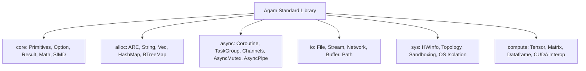

# Agam Language Requirements Specification (LRS)

> **Document Status:** Active Standard  
> **Author:** Agam Core Language Design & Architecture Team  
> **Target Version:** Agam 0.1.0+

---

## 1. Executive Summary

- **Language Name:** **Agam** (`.agam`)  
  *Etymology:* Rooted in the classical Dravidian/Sanskrit term meaning *"the inner essence / core consciousness"*, symbolizing intrinsic mathematical correctness, memory safety without garbage collection pauses, and transparent bare-metal execution.
- **Primary Domain:** High-performance systems engineering, heterogeneous compute (CPU, GPU, Tensor/SIMD), mission-critical embedded IoT, and scalable asynchronous backend services.
- **Key Differentiators:**
  1. **Dual-Tier Adaptive Memory Model:** Frictionless automatic ARC by default, seamlessly switchable to zero-overhead affine ownership / no-heap region allocation via `@target.iot` and `@target.hpc` profiles.
  2. **Type Sandhi Harmonic Lattice:** High-order constraint-based subtyping with transitive supertrait closure and $O(1)$ bound satisfaction without runtime vtable overhead.
  3. **Unified Heterogeneous Code Generation:** Write high-level code once, lower through typed SSA MIR, and compile simultaneously to Native JIT (Cranelift), LLVM IR, ANSI C11, and PTX/SPIR-V/Metal GPU kernels.
  4. **Algebraic Effect System & Structured Async Coroutines:** First-class algebraic effect typing with stackless state machine transformations and nursery-scoped structured concurrency.
- **Target Users:** Systems engineers, performance-sensitive infrastructure architects, embedded developers, scientific computing researchers, and distributed backend designers transitioning from C/C++, Rust, or Go.

---

## 2. Core Language Goals

### 2.1 Primary Goal
To deliver a modern, mathematically verified systems programming language that achieves bare-metal C/Rust performance while eliminating memory safety hazards, concurrency race conditions, and GPU/CPU heterogeneous code duplication.

### 2.2 Secondary Goals
- **Deterministic Latency:** Zero hidden allocations or unpredictable GC pauses; predictable deallocation via affine destruction and RAII.
- **Single Universal Pipeline:** One language front-end driving embedded microcontrollers (C11 output), HPC compute clusters (LLVM IR), real-time graphics/AI (NVPTX/SPIR-V), and live REPLs (JIT).
- **Deep Algorithmic Synthesis:** First-class syntax and type-level representations for tensors, dataframes, fixed-width integers (`i1..i512`), and algebraic data types.

### 2.3 Non-Goals
- **Dynamic / Untyped Prototyping:** Agam is strictly statically typed; runtime type reflection or dynamic type coercion is explicitly rejected.
- **Global Garbage Collection:** No global stop-the-world tracing GC.
- **Implicit Coercions:** No silent narrowing or widening conversions across integer/float sizes.

### 2.4 Success Metrics
| Metric | Target | Verification Method |
|---|---|---|
| **Compilation Throughput** | $> 500,000$ lines/sec (Lexer) / $> 100,000$ lines/sec (Full Pipeline to JIT) | Automated micro-benchmarks in `agam_test::perf_speed` |
| **Execution Performance** | $\le 1.05\times$ of optimized C/C++ (`-O3`) across standard benchmarks | Criterion benchmarks in `benchmarks/` |
| **Task Concurrency Scale** | $> 1,000,000$ active concurrent coroutine tasks per GB of memory | Stress tests in `agam_test::async_concurrency` |
| **Safety Invariants** | $0$ data races, $0$ use-after-free, $0$ unhandled algebraic effects | Formal verification & borrow check passes |

---

## 3. Technical Requirements

### 3.1 Type System
- **Type Checking:** Strict static type checking with bidirectional constraint propagation.
- **Type Inference:** Hindley-Milner style local and inter-procedural type inference; explicit annotations required only at module-level public API boundaries.
- **Type Safety:** Guaranteed memory safety, null-pointer safety (Option monad), and integer overflow protection with verified wrap/saturating/checked modes.
- **Generic Programming:** Monomorphized parametric polymorphism, higher-kinded trait bounds, associated types, and const generics (e.g., `Tensor[f32, [3, 3]]`).
- **Type Annotations:** Suffix type annotations with clean colon syntax (`let x: i32 = 42; fn compute(val: String) -> Result[i64, Error]`).

### 3.2 Memory Model
- **Management Strategy:**
  - *Standard Profile:* Deterministic Atomic Reference Counting (ARC) with compile-time cycle-detection warnings and localized arena pools.
  - *Embedded / Real-Time Profile (`@target.iot`):* Strict affine ownership with borrowing; heap allocation and runtime ARC are statically prohibited.
  - *HPC Profile (`@target.hpc`):* Cache-line aligned (64-byte) chunked region allocation with SIMD lane affinity.
- **Allocation Patterns:** Aggressive stack allocation and scalar replacement of aggregates (SROA); heap used only when objects escape the function frame.
- **Ownership Semantics:** Linear values with move-by-default for non-copy types; shared read borrows (`&T`) and exclusive mutable borrows (`&mut T`) enforced statically.
- **Concurrency Safety:** `Send` and `Sync` lattice markers guarantee that unshared mutable state cannot cross thread or coroutine task boundaries without synchronization primitives.
- **Resource Management:** Deterministic RAII destructors (`Drop` trait).

### 3.3 Execution Model
- **Evaluation Strategy:** Strict, eager call-by-value with short-circuiting boolean evaluation and lazy iterator adapters.
- **Concurrency Model:** Multi-threaded work-stealing M:N scheduler with lock-free per-worker deque rings and global injector queues.
- **Async Support:** Stackless coroutines transformed into SSA state machine basic blocks; `async fn` and `await` syntax; `TaskGroup` nurseries for structured lifecycles.
- **Error Handling:** First-class algebraic `Result[T, E]` and algebraic effect handlers (`effect` / `handle` / `resume`), completely avoiding unhandled stack unwind panics.
- **Performance Profile:** Multi-target native compilation (LLVM IR / ANSI C11 / PTX / Native JIT).

### 3.4 Language Features
- **Functions:** First-class functions, non-capturing fn pointers, and capturing stack/heap closures.
- **Objects & Types:** Structs with field-level visibility, tagged unions (enums with typed payloads), and declarative traits with default method bodies.
- **Modules & Packages:** Hierarchical module paths (`crate::module::item`), explicit visibility (`pub`, `pub(crate)`), and deterministic lockfile-driven dependency management (`agam_pkg`).
- **Metaprogramming:** Compile-time AST procedural macros, quote/unquote hygiene, and compile-time constant evaluation (`const fn`).
- **Pattern Matching:** Exhaustive structural pattern matching over literals, structs, tagged unions, and slice ranges with guard clauses (`match val { Some(x) if x > 0 => ... }`).

---

## 4. Standard Library Scope



- **Core Primitives:** `bool`, `i1..i512`, `u1..u512`, `f16`, `f32`, `f64`, `f128`, `char`, `str`, `Option[T]`, `Result[T, E]`.
- **I/O & Streams:** Non-blocking async streams (`AsyncRead`, `AsyncWrite`, `AsyncPipe`), buffered I/O, file systems, TCP/UDP sockets.
- **Synchronization Primitives:** `AsyncMutex`, `AsyncRwLock`, `AsyncCondvar`, `AsyncSemaphore`, `AsyncBarrier`, lock-free MPSC / oneshot channels.
- **Mathematical & Compute Intrinsics:** Vectorized 2D/3D math, BLAS/LAPACK tensor primitives, and automatic SIMD tier detection (SSE4.2, AVX2, AVX-512, ARM NEON).

---

## 5. Interoperability Requirements

- **C FFI (`extern "C"`):** Direct zero-overhead C ABI calling convention with zero-copy struct layout mapping (`#[repr(C)]`).
- **Embedding & Sandbox:** Clean C-compatible embedding API (`agam_runtime_init`, `agam_eval`) with OS job-object / cgroup resource isolation policies.
- **Build Integration:** Native package manager and build orchestrator (`agam build`, `agam check`, `agam test`, `agam run`).
- **Tool Support:** Language Server Protocol (`agam_lsp`) with hover docs, completion, diagnostics, jump-to-definition, and DAP debugging protocol support.

---

## 6. Implementation Priorities

```mermaid
gantt
    title Agam Language Implementation Roadmap
    dateFormat  YYYY-MM-DD
    section Phase 1: Core Compiler
    Lexer, Parser, AST, Sandhi Type Solver, MIR Engine :done, p1, 2026-01-01, 2026-03-31
    section Phase 2: Multi-Target Codegen
    C11, LLVM IR, NVPTX GPU Emitter, JIT Runtime :done, p2, 2026-04-01, 2026-06-30
    section Phase 3: Concurrency & Async
    M:N Work-Stealing, State Machines, Async I/O, Nurseries :done, p3, 2026-07-01, 2026-08-20
    section Phase 4: Universal GPU Adapter
    AMDGPU, SPIR-V Vulkan, Apple Metal, Tensor Core passes :active, p4, 2026-08-21, 2026-10-31
    section Phase 5: Ecosystem & Tooling
    LSP extensions, Package Registry Index, Profiler, IDE debuggers : p5, 2026-11-01, 2026-12-31
```

1. **Phase 1 (Complete):** Core language syntax, Pratt parser, Sandhi type solver, bidirectional HM inference, two-tiered HIR/MIR.
2. **Phase 2 (Complete):** Multi-target codegen (C11, LLVM IR, NVPTX, JIT engine) and OS sandboxing.
3. **Phase 3 (Complete):** Stackless coroutines, event-driven task waking, `AsyncRwLock`/`AsyncCondvar`, non-blocking I/O streaming, and structured nurseries.
4. **Phase 4 (Next Active):** Universal GPU Target Adapter (`GpuTargetAdapter`) supporting AMDGPU ROCm/HIP, SPIR-V Vulkan, and Apple Metal.
5. **Phase 5:** Package registry cloud sync, debugger integration (`agam-gdb`/`agam-lldb`), and IDE enhancements.

---

## 7. Performance Requirements & Constraints

| Dimension | Target Specification | Enforcement Mechanism |
|---|---|---|
| **Compilation Latency** | $< 100\text{ ms}$ for incremental rebuilds | Incremental salsa-style caching & memoized AST queries |
| **Cold Startup Time** | $< 2\text{ ms}$ for native CLI binaries | Zero static global initialization cost; compact ELF/PE headers |
| **Async Task Switch** | $< 15\text{ ns}$ per coroutine context switch | Direct function pointer jump in SSA state machine |
| **Binary Size** | $< 50\text{ KB}$ for `@target.iot` no-heap binaries | Dead-code elimination & symbol stripping at MIR level |
