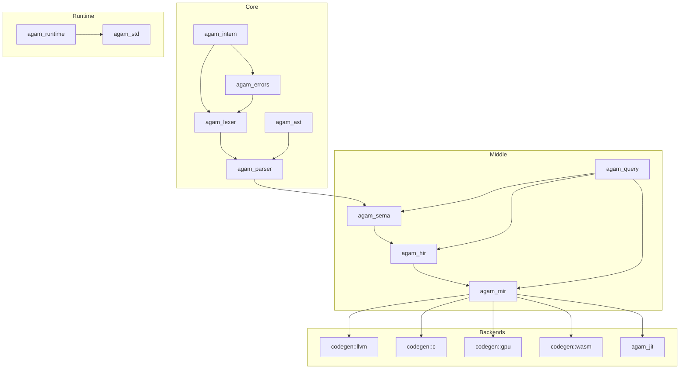

# Agam Compiler Architecture — World-Class Design

> This document defines the target architecture for a production-grade, world-class Agam compiler.
> It audits the current ~45K-line Rust codebase and prescribes the evolution needed to compete
> with Rust, Swift, Zig, and Mojo compilers.

---

## 1. Current State Audit

### Codebase Profile (90 source files, ~45K lines)

| Layer | Crates | LOC | Maturity |
|-------|--------|----:|----------|
| **Core** | `agam_errors` (633), `agam_lexer` (1336), `agam_parser` (1774), `agam_ast` (1124) | ~4,867 | Solid |
| **Middle** | `agam_sema` (4,655), `agam_hir` (1,753), `agam_mir` (2,847) | ~9,255 | Good foundation, needs generics/monomorphization |
| **Backends** | `agam_codegen` (9,439), `agam_jit` (4,163) | ~13,602 | Strong — LLVM, C, GPU, JIT all working |
| **Runtime** | `agam_runtime` (2,477), `agam_std` (2,944) | ~5,421 | Needs stdlib depth |
| **Tooling** | `agam_driver` (14,592), `agam_pkg` (5,575), others | ~11,000+ | Driver is monolithic — needs decomposition |

### Architectural Strengths
- Clean SSA-based MIR with basic blocks, phi nodes, terminators
- Three working backends (LLVM, C, Cranelift JIT)
- Interned type store with well-known primitive IDs
- GPU/NVPTX pipeline with shared memory and math intrinsics
- Algebraic effects system (perform/handle) through full pipeline
- Fixed-point MIR optimization loop (inline → constant_fold → loop_unroll → DCE)
- Incremental daemon with warm-state caching

### Architectural Weaknesses

| Issue | Impact | Location |
|-------|--------|----------|
| **14.5K-line monolithic driver** | Untestable, unmaintainable | `agam_driver/src/main.rs` |
| **Linear type dedup in TypeStore** | O(n) per insert, will not scale | `agam_sema/src/types.rs:131` |
| **No query-based compilation** | Cannot do incremental type-checking | Entire pipeline is batch |
| **String-based name resolution** | `Op::Call { callee: String }` — no interned symbols in MIR | `agam_mir/src/ir.rs:86` |
| **No source locations in MIR** | Debug info emission impossible | `MirFunction` has no spans |
| **No monomorphization pass** | Generics AST nodes exist but don't lower | `agam_hir/src/lower.rs` |
| **Sema modules not integrated** | Ownership, lifetime, trait modules exist but aren't wired into main checker | `agam_sema/src/checker.rs` |
| **No error recovery in parser** | First error stops compilation | `agam_parser/src/parser.rs` |

---

## 2. Target Architecture

### Design Principles

1. **Query-based compilation** — Every compilation step is a memoized query (like rustc/Salsa)
2. **Arena allocation** — All IR nodes allocated in typed arenas, zero-copy references
3. **Interned identifiers** — All names go through a global string interner, compared by ID
4. **Span preservation** — Source locations survive through every IR level to codegen
5. **Parallel by default** — Function-level parallelism in type-checking and codegen
6. **Incremental by default** — Change a function, recheck only its dependents

### Pipeline Overview

```
Source Text
    │
    ▼
┌─────────────────────────────────────────────────────────┐
│  FRONTEND                                                │
│                                                          │
│  Lexer ──► Token Stream ──► Parser ──► Untyped AST      │
│                                    (with error recovery)  │
│                                                          │
│  Name Resolution ──► Resolved AST (symbols interned)     │
│  Type Inference   ──► Typed AST   (all exprs have types) │
│  Trait Resolution ──► Coherent AST (methods resolved)    │
│  Ownership Check  ──► Verified AST (borrows valid)       │
│  Effect Check     ──► Effect-safe AST                    │
└─────────────────────────────────────────────────────────┘
    │
    ▼
┌─────────────────────────────────────────────────────────┐
│  MIDDLE-END                                              │
│                                                          │
│  HIR Lowering ──► HIR (desugared, typed, with spans)     │
│  Monomorphization ──► Specialized HIR (no generics)      │
│  MIR Lowering ──► MIR (SSA, CFG, basic blocks)           │
│                                                          │
│  ┌─ Optimization Pipeline (fixed-point) ──────────────┐  │
│  │  Inline → ConstFold → LoopOpt → SROA → DCE        │  │
│  │  → EscapeAnalysis → StackPromotion → Devirt        │  │
│  │  → AutoDiff Transform → GPU Kernel Extract         │  │
│  └────────────────────────────────────────────────────┘  │
└─────────────────────────────────────────────────────────┘
    │
    ├──► LLVM Backend ──► Native Binary (.exe/.elf/.dylib)
    ├──► C Backend ──► Portable C source ──► Native Binary
    ├──► Cranelift JIT ──► In-memory execution
    ├──► NVPTX Backend ──► GPU Kernel (.ptx)
    └──► WASM Backend ──► WebAssembly (.wasm)
```

---

## 3. Core Subsystem Designs

### 3.1 Interned Identifiers and Arenas

**Problem:** Current MIR uses `String` for function names and variable names. This wastes memory, makes comparison O(n), and prevents efficient symbol tables.

**Solution:** Global string interner + typed arenas.

```rust
// New crate: agam_intern
/// A globally interned string — comparison is O(1) by index.
#[derive(Copy, Clone, Eq, PartialEq, Hash)]
pub struct Symbol(u32);

/// Thread-safe string interner with lock-free reads.
pub struct Interner {
    map: DashMap<&'static str, Symbol>,
    strings: Vec<&'static str>,  // leaked for 'static lifetime
}

impl Interner {
    pub fn intern(&self, s: &str) -> Symbol { /* ... */ }
    pub fn resolve(&self, sym: Symbol) -> &str { /* ... */ }
}

// Usage in MIR — before:
//   Op::Call { callee: String, args: Vec<ValueId> }
// After:
//   Op::Call { callee: Symbol, args: Vec<ValueId> }
```

**Impact:** ~30% memory reduction in MIR, O(1) name comparisons, enables efficient hash maps keyed by symbol.

### 3.2 Query-Based Compilation (Salsa-Inspired)

**Problem:** Current pipeline is batch — parse everything, check everything, lower everything. No incrementality beyond the daemon's file-level caching.

**Solution:** Query framework where each compilation step is a memoized, dependency-tracked function.

```rust
// Core query trait
#[salsa::query_group(CompilerDatabase)]
pub trait CompilerDb {
    #[salsa::input]
    fn source_text(&self, file: FileId) -> Arc<String>;

    fn parse(&self, file: FileId) -> Arc<ParseResult>;
    fn resolve_names(&self, file: FileId) -> Arc<ResolvedModule>;
    fn type_check(&self, func: FuncId) -> Arc<TypeCheckResult>;
    fn lower_to_hir(&self, func: FuncId) -> Arc<HirFunction>;
    fn lower_to_mir(&self, func: FuncId) -> Arc<MirFunction>;
    fn optimized_mir(&self, func: FuncId) -> Arc<MirFunction>;
    fn codegen(&self, func: FuncId) -> Arc<CodegenResult>;
}
```

**Impact:** Change one function → only re-typecheck and re-lower that function and its callers. LSP gets sub-100ms response times.

### 3.3 Span Preservation Through All IR Levels

**Problem:** MIR has no source locations. Debug info (DWARF/CodeView) cannot be emitted. Error messages from MIR optimization cannot point to source.

**Solution:** Add `Span` to every IR node.

```rust
// MIR instruction with span
pub struct Instruction {
    pub result: ValueId,
    pub ty: TypeId,
    pub op: Op,
    pub span: Span,  // NEW: source location preserved through all lowering
}

// HIR already has HirId — add span mapping
pub struct SpanMap {
    hir_spans: FxHashMap<HirId, Span>,
    mir_spans: FxHashMap<(FuncId, ValueId), Span>,
}
```

### 3.4 TypeStore Performance

**Problem:** Current `TypeStore::insert` does linear scan for deduplication — O(n) per insertion.

**Solution:** Hash-based interning with FxHashMap.

```rust
pub struct TypeStore {
    types: Vec<Type>,
    dedup: FxHashMap<Type, TypeId>,  // O(1) lookup
}

impl TypeStore {
    pub fn insert(&mut self, ty: Type) -> TypeId {
        if let Some(&id) = self.dedup.get(&ty) {
            return id;
        }
        let id = TypeId(self.types.len() as u32);
        self.dedup.insert(ty.clone(), id);
        self.types.push(ty);
        id
    }
}
```

### 3.5 Monomorphization Pipeline

**Problem:** AST has `GenericParam`, `TypeExpr::Generic`, but no pass converts generic functions/types into concrete specialized versions.

**Solution:** Monomorphization pass between HIR and MIR.

```
HIR (generic)
    │
    ▼
Monomorphization Collector
  - Walk call graph from entry points
  - For each generic call, record concrete type arguments
  - Generate specialized copies: map<T> with T=i32 → map_i32
    │
    ▼
Specialized HIR (no type parameters remain)
    │
    ▼
MIR Lowering (existing — unchanged)
```

```rust
// New module: agam_hir::monomorphize
pub struct MonoCollector {
    /// Queue of (generic_func, concrete_type_args) to specialize
    work_queue: VecDeque<(FuncId, Vec<TypeId>)>,
    /// Already specialized functions
    done: FxHashMap<(FuncId, Vec<TypeId>), FuncId>,
}

pub fn monomorphize(module: &HirModule, types: &TypeStore) -> HirModule {
    let mut collector = MonoCollector::new();
    collector.seed_from_entry_points(module);
    while let Some((func, args)) = collector.work_queue.pop_front() {
        let specialized = specialize_function(func, &args, types);
        // Recursively discover new instantiations in the specialized body
        collector.scan_calls(&specialized);
    }
    collector.into_module()
}
```

### 3.6 Driver Decomposition

**Problem:** `agam_driver/src/main.rs` is 14,592 lines — a monolithic god file containing CLI parsing, compilation orchestration, daemon management, REPL, packaging, and execution.

**Solution:** Extract into focused modules.

```
agam_driver/src/
├── main.rs              (~200 lines — CLI entry, dispatch to subcommands)
├── cli/
│   ├── mod.rs           (Clap argument definitions)
│   ├── build.rs         (build/run/check command)
│   ├── dev.rs           (dev loop command)
│   ├── repl.rs          (REPL command)
│   ├── exec.rs          (headless execution)
│   ├── fmt.rs            (format command)
│   ├── test.rs          (test command)
│   ├── doctor.rs        (environment diagnostics)
│   ├── package.rs       (SDK packaging)
│   ├── registry.rs      (publish/install/audit)
│   └── env.rs           (environment management)
├── compile/
│   ├── mod.rs           (CompilationSession — orchestrates the pipeline)
│   ├── pipeline.rs      (parse → sema → hir → mir → codegen)
│   └── parallel.rs      (parallel compilation coordinator)
├── daemon/
│   ├── mod.rs           (DaemonSession, warm state management)
│   ├── ipc.rs           (TCP IPC protocol)
│   └── incremental.rs   (IncrementalPipeline, snapshot diffs)
└── output/
    ├── diagnostics.rs   (error rendering, color, JSON format)
    └── progress.rs      (compilation progress reporting)
```

### 3.7 Enhanced MIR Optimization Pipeline

**Current:** inline → constant_fold → loop_unroll → constant_fold → DCE (fixed-point)

**Target:** A configurable, pass-managed pipeline with analysis infrastructure.

```rust
pub struct PassManager {
    passes: Vec<Box<dyn MirPass>>,
    analysis_cache: AnalysisCache,
}

pub trait MirPass {
    fn name(&self) -> &str;
    fn run(&self, func: &mut MirFunction, ctx: &mut PassContext) -> bool;
    fn invalidates(&self) -> &[AnalysisId]; // Which analyses this pass invalidates
    fn requires(&self) -> &[AnalysisId];    // Which analyses this pass needs
}

// Analysis infrastructure
pub trait Analysis {
    type Result;
    fn run(&self, func: &MirFunction) -> Self::Result;
}

// Concrete analyses
pub struct DominatorTree;       // Required for SSA validation, loop detection
pub struct LoopNestTree;        // Required for loop optimizations
pub struct AliasAnalysis;       // Required for load/store optimization
pub struct CallGraph;           // Required for inlining decisions, devirtualization
pub struct EscapeAnalysis;      // Already exists — integrate into framework
pub struct LivenessAnalysis;    // Required for register allocation hints

// Target optimization pipeline at -O3:
fn build_o3_pipeline() -> PassManager {
    PassManager::new()
        // Canonicalization
        .add(SimplifyCFG)
        .add(InstructionCombine)
        // Inlining
        .add(InlineSmallFunctions { threshold: 100 })
        .add(InlineHotFunctions)  // PGO-guided
        // Scalar optimizations
        .add(SROA)                // Scalar Replacement of Aggregates
        .add(ConstantFold)
        .add(GVN)                 // Global Value Numbering
        .add(LICM)                // Loop-Invariant Code Motion
        // Loop optimizations
        .add(LoopUnroll { factor: 4 })
        .add(LoopVectorize)
        .add(LoopTiling { tile_size: 32 })
        // Memory optimizations
        .add(EscapeAnalysis)
        .add(StackPromotion)
        .add(DeadStoreElimination)
        // Cleanup
        .add(DCE)
        .add(SimplifyCFG)
        // Domain-specific
        .add(AutoDiffTransform)   // Reverse-mode AD for @differentiable
        .add(GpuKernelExtract)    // Extract @gpu functions to NVPTX module
        .add(Devirtualize)        // Convert dyn dispatch to static where possible
}
```

---

## 4. New Crate Architecture

### 4.1 Proposed Crate Map

```
crates/
├── core/
│   ├── agam_intern/       [NEW] String interning, Symbol type, arena allocators
│   ├── agam_errors/       Enhanced diagnostics with recovery, suggestions, color
│   ├── agam_lexer/        Token stream with error recovery tokens
│   ├── agam_parser/       Recursive descent with synchronization points
│   └── agam_ast/          Unchanged — already well-structured
│
├── middle/
│   ├── agam_sema/         Wire ownership+lifetime+traits into main checker
│   ├── agam_hir/
│   │   ├── lower.rs       AST → HIR lowering
│   │   ├── monomorphize.rs [NEW] Generic specialization
│   │   └── nodes.rs       Add Span to all nodes
│   ├── agam_mir/
│   │   ├── ir.rs          Symbol-based names, spans on instructions
│   │   ├── lower.rs       HIR → MIR
│   │   ├── analysis/      [NEW] Dominator tree, call graph, alias analysis
│   │   └── opt/           Enhanced with pass manager framework
│   └── agam_query/        [NEW] Salsa-inspired query/caching framework
│
├── backends/
│   ├── agam_codegen/
│   │   ├── llvm/          [SPLIT] LLVM emitter + debug info
│   │   ├── c/             [SPLIT] C emitter
│   │   ├── gpu/           [SPLIT] NVPTX emitter
│   │   └── wasm/          [NEW] WASM emitter
│   └── agam_jit/          Cranelift JIT — add debug info support
│
├── runtime/
│   ├── agam_runtime/      Add async runtime, ARC optimization
│   └── agam_std/          Expand: collections, networking, async I/O
│
├── tooling/
│   ├── agam_driver/       [DECOMPOSE] 14.5K → ~200-line main + modules
│   ├── agam_pkg/          Add remote registry, SAT resolver
│   ├── agam_fmt/          Understand all new syntax forms
│   ├── agam_lsp/          [MAJOR] Full LSP implementation
│   ├── agam_doc/          [MAJOR] Doc generation pipeline
│   ├── agam_debug/        [MAJOR] DAP server, DWARF/CodeView
│   ├── agam_test/         [MAJOR] Full test runner
│   ├── agam_lint/         [MAJOR] Lint pass framework
│   └── agam_profile/      PGO data collection and merging
│
└── experiments/
    ├── agam_ffi/           Unchanged
    ├── agam_notebook/      Unchanged
    ├── agam_smt/           Expand for formal verification
    └── agam_macro/         Procedural macro system
```

### 4.2 Dependency Graph



---

## 5. Performance Architecture

### 5.1 Compilation Speed Targets

| Metric | Current | Target | How |
|--------|---------|--------|-----|
| Parse throughput | ~50K lines/sec | 500K lines/sec | Arena alloc, SIMD lexer |
| Type check | Batch | Incremental per-function | Query framework |
| MIR optimization | Sequential | Parallel per-function | Rayon work-stealing |
| LLVM codegen | Sequential | Parallel per-function | Thread pool |
| Full rebuild (1K functions) | ~5s | <1s | All of the above |
| Incremental (1 function changed) | ~2s | <100ms | Query memoization |

### 5.2 Memory Efficiency

| Technique | Savings | Where |
|-----------|---------|-------|
| String interning | ~30% MIR memory | All names → Symbol(u32) |
| Arena allocation | ~20% allocation overhead | AST, HIR nodes |
| TypeId dedup via HashMap | O(1) vs O(n) insert | TypeStore |
| Lazy MIR serialization | Only serialize on daemon save | Warm state cache |
| COW for incremental | Share unchanged functions | Query framework |

### 5.3 Generated Code Quality Targets

| Benchmark | Current | Target | Strategy |
|-----------|---------|--------|----------|
| Fibonacci recursive | 1.0x clang++ | 0.95x clang++ | PGO + call cache |
| Matrix multiply | Untested | 0.9x clang++ | Loop tiling + vectorization |
| String processing | Untested | 1.0x clang++ | SROA + escape analysis |
| Tensor ops (GPU) | IR only | Real CUDA execution | Complete kernel launch |

---

## 6. Execution Priority

### Phase 1: Foundation (Weeks 1–8)
1. Create `agam_intern` crate — global string interner
2. Add `Span` to `MirFunction` and `Instruction`
3. Replace `String` with `Symbol` in MIR `Op::Call`, `Op::LoadLocal`, `Op::StoreLocal`
4. Replace linear scan in `TypeStore::insert` with `FxHashMap`
5. Begin driver decomposition — extract CLI modules

### Phase 2: Type System (Weeks 9–20)
6. Wire `ownership.rs`, `lifetime.rs`, `traits.rs` into `checker.rs` main pass
7. Implement monomorphization collector in `agam_hir`
8. Add `GenericInstantiation` tracking in sema
9. Lower generic function calls through monomorphized copies

### Phase 3: Optimization (Weeks 21–28)
10. Build pass manager framework in `agam_mir::opt`
11. Add dominator tree and loop nest analysis
12. Implement GVN, LICM, SROA passes
13. Add loop vectorization pass

### Phase 4: Backend Excellence (Weeks 29–36)
14. DWARF debug info emission in LLVM backend
15. WASM backend via LLVM wasm target
16. Split `agam_codegen` into `llvm/`, `c/`, `gpu/`, `wasm/` modules
17. Complete GPU kernel launch lowering

### Phase 5: Tooling (Weeks 37–48)
18. LSP implementation with go-to-def, completion, hover
19. Doc generation pipeline
20. DAP debugger server
21. Query-based incremental compilation

---

## 7. Key Invariants

These invariants must hold across the entire compiler:

1. **Every expression has a type.** After sema, no `TypeId::Error` escapes without a diagnostic.
2. **Every IR node has a source span.** From AST through MIR to codegen.
3. **Names are interned.** No raw `String` in any IR after parsing.
4. **MIR is valid SSA.** Every `ValueId` is defined exactly once, dominates all uses.
5. **Optimization is monotonic.** No pass introduces new undefined behavior.
6. **Errors are recoverable.** Parser and sema continue after errors to report maximum diagnostics.
7. **Backends are target-independent.** MIR contains no target-specific operations (except GPU intrinsics which are explicitly marked).
8. **The driver is thin.** Compilation logic lives in library crates, not in `main.rs`.

---

## 8. Comparison With World-Class Compilers

| Feature | rustc | swiftc | Zig | Agam (Current) | Agam (Target) |
|---------|-------|--------|-----|----------------|---------------|
| Query-based compilation | ✅ (Salsa) | ✅ (request evaluator) | ❌ | ❌ | ✅ |
| Incremental type-checking | ✅ | ✅ | ❌ | ❌ (file-level) | ✅ (function-level) |
| String interning | ✅ | ✅ | ✅ | ❌ | ✅ |
| Span preservation to codegen | ✅ | ✅ | ✅ | ❌ | ✅ |
| Monomorphization | ✅ | ✅ (witness tables) | ✅ (comptime) | ❌ | ✅ |
| Error recovery | ✅ | ✅ | ✅ | ❌ | ✅ |
| DWARF/CodeView debug info | ✅ | ✅ | ✅ | ❌ | ✅ |
| Pass manager framework | ✅ | ✅ (SIL) | ✅ | Partial | ✅ |
| Parallel codegen | ✅ | ✅ | ✅ | ❌ | ✅ |
| WASM target | ✅ | ❌ | ✅ | ❌ | ✅ |
| GPU target | ❌ | ❌ | ❌ | ✅ | ✅ |
| Effects system | ❌ | ❌ | ❌ | ✅ | ✅ |
| Autodiff | ❌ | ✅ (differentiable) | ❌ | Partial (HIR) | ✅ |
| Multiple syntax modes | ❌ | ❌ | ❌ | ✅ | ✅ |
| Native GUI framework | ❌ | ✅ (SwiftUI) | ❌ | Stub | ✅ (GPU-accelerated) |
| Declarative UI syntax | ❌ | ✅ (SwiftUI) | ❌ | ❌ | ✅ (@ui DSL) |
| Capability-based security | ❌ | ❌ | ❌ | ❌ | ✅ |
| Formal verification | ❌ | ❌ | ❌ | Stub | ✅ (SMT) |
| Universal FFI | Partial | Partial | ✅ (C) | Stub | ✅ (C/C++/Py/Rust/Java/JS) |
| Hot-reload GUI | ❌ | ✅ (SwiftUI Previews) | ❌ | ❌ | ✅ |

---

## 9. GUI Subsystem Architecture

The GUI is a first-class compiler concern, not a library bolt-on. See `docs/architecture/gui-architecture.md` for the complete design.

### Key Design Decisions

1. **`@ui` is parsed by the compiler** — not a macro, not a library DSL. The parser understands widget trees natively, enabling compile-time validation, type-checked bindings, and IDE support.

2. **Reactive state is a compiler feature** — `@observable` triggers automatic dependency tracking at compile time. The compiler inserts minimal change-detection code, not a runtime framework.

3. **GPU rendering is the default** — The render pipeline talks directly to D3D12/Metal/Vulkan/WebGPU. CPU fallback exists for headless/CI only.

4. **Hot-reload uses the existing JIT** — `agam_jit` (Cranelift) enables function-level hot-swap. The daemon's warm state enables <100ms style updates.

### Crate Integration

```
agam_parser  →  @ui DSL parsing, widget tree AST nodes
agam_sema    →  @observable dependency analysis, @capabilities checking
agam_hir     →  Reactive lowering (insert change-detection nodes)
agam_ui      →  Widget runtime, layout engine, GPU render pipeline
agam_jit     →  Hot-reload function swap
agam_codegen →  GPU shader compilation for UI rendering
```

---

## 10. Security Subsystem Architecture

Security is enforced at compile time, not at runtime. See `details/SEC1.md` for the full phase specification.

### Compiler-Enforced Security

```
Source Code
    │
    ▼
Parser → @capabilities, @tainted, @verify annotations
    │
    ▼
Sema → Capability propagation check
     → Taint flow analysis (tainted data → sink = error)
     → Integer overflow mode enforcement
     → Secret<T> usage validation
    │
    ▼
SMT Solver → @verify pre/post-condition proofs
           → Constant-time execution proofs
           → Buffer overflow absence proofs
    │
    ▼
Codegen → Stack canary insertion
        → Bounds check insertion (where not statically proven)
        → Secret memory zeroing on drop
```

---

## 11. Updated Crate Map (with GUI + Security + FFI)

```
crates/
├── core/
│   ├── agam_intern/       [NEW] String interning, Symbol type
│   ├── agam_errors/       Diagnostics, recovery, suggestions
│   ├── agam_lexer/        Token stream
│   ├── agam_parser/       Recursive descent + @ui DSL + error recovery
│   └── agam_ast/          AST including UI widget tree nodes
│
├── middle/
│   ├── agam_sema/         Type checking + capability analysis + taint tracking
│   ├── agam_hir/          HIR + monomorphization + reactive lowering
│   ├── agam_mir/          MIR + pass manager + analyses
│   └── agam_query/        [NEW] Query/caching framework
│
├── backends/
│   ├── agam_codegen/
│   │   ├── llvm/          LLVM + debug info + security instrumentation
│   │   ├── c/             C emitter
│   │   ├── gpu/           NVPTX + UI shader compilation
│   │   └── wasm/          [NEW] WASM emitter
│   └── agam_jit/          Cranelift JIT + hot-reload swap
│
├── runtime/
│   ├── agam_runtime/      Async runtime, ARC, sandbox, crypto CSPRNG
│   ├── agam_std/          Collections, networking, crypto, I/O
│   └── agam_ui/           [EXPAND] Widget runtime, layout, GPU render,
│                          reactive engine, theme system, components,
│                          platform backends (Win/Mac/Linux/Web/Android)
│
├── tooling/
│   ├── agam_driver/       Decomposed CLI + agamc architect/preview
│   ├── agam_pkg/          Package manager + capability manifests + SBOM
│   ├── agam_fmt/          Formatter including @ui code
│   ├── agam_lsp/          LSP + UI widget completion + live preview
│   ├── agam_doc/          Doc generation
│   ├── agam_debug/        DAP server + UI widget inspector
│   ├── agam_test/         Test runner + UI snapshot testing
│   ├── agam_lint/         Lint passes + security lints
│   └── agam_profile/      PGO + frame timing + GPU profiling
│
└── experiments/
    ├── agam_ffi/           [EXPAND] Universal FFI: C/C++/Py/Rust/Java/JS
    ├── agam_smt/           [EXPAND] SMT solver + formal verification
    ├── agam_macro/         Procedural macro system
    └── agam_notebook/      Jupyter-style notebooks
```

---

## 12. Build System Architecture (Pillars 18–22)

### The "One Tool" Principle

```
agamc ─────┬── build      Compile project (LLVM/C/JIT/WASM)
           ├── run        Build + execute
           ├── check      Type-check only (no codegen)
           ├── test       Run test suite + coverage
           ├── bench      Run benchmarks
           ├── fmt        Format all source files
           ├── lint       Run lint passes + security lints
           ├── doc        Generate documentation
           ├── repl       Interactive REPL with JIT
           ├── dev        Watch mode + hot-reload
           ├── new        Create new project
           ├── add        Add dependency to agam.toml
           ├── remove     Remove dependency
           ├── update     Update dependencies
           ├── publish    Publish to registry
           ├── install    Install global tool
           ├── search     Search package registry
           ├── audit      Security + capability audit
           ├── sbom       Generate SBOM (SPDX/CycloneDX)
           ├── vendor     Download deps for offline builds
           ├── doctor     Environment diagnostics
           ├── daemon     Background compilation daemon
           ├── cache      Cache management
           ├── env        Toolchain version management
           ├── preview    GUI live preview
           ├── architect  Visual UI builder
           └── registry   serve / mirror / sync
```

**Zero external dependencies.** One binary does everything. No pip, no npm, no conda, no pytest, no black.

### Reproducibility Pipeline

```
agam.toml (dependencies + toolchain version)
    │
    ▼
Resolver (deterministic, sorted, no floating versions)
    │
    ▼
agam.lock (every dep hashed with SHA-256 Merkle tree)
    │                        ┌─── Compiler version hash
    │                        ├─── Source code hash
    │                        └─── Dependency tree hash (recursive)
    ▼
Build (reproducible: no timestamps, no paths, no random seeds)
    │
    ▼
Output Binary + Build Provenance Attestation
    (signed statement: "this binary was built from this exact lockfile")
```

### Supply Chain Security Model

```
Developer publishes package:
    1. Signs with Ed25519 key
    2. Declares capabilities: [fs=false, net=false, process=false]
    3. Transparency log records publish event

Consumer installs package:
    1. Verify signature
    2. Check capabilities against project's allowlist
    3. Typosquat detection (Levenshtein distance against known packages)
    4. Vulnerability scan against advisory database
    5. SBOM entry generated
```

### Federated Registry Architecture

```
                    ┌─────────────────────┐
                    │  Central Registry    │
                    │  registry.agam.org   │
                    └─────────┬───────────┘
                              │ peer/mirror
                ┌─────────────┼──────────────┐
                ▼             ▼              ▼
        ┌───────────┐ ┌────────────┐ ┌──────────┐
        │ Corporate │ │   Mirror   │ │   IPFS   │
        │ Private   │ │   Proxy    │ │  Content │
        │ Registry  │ │   Cache    │ │ Addressed│
        └───────────┘ └────────────┘ └──────────┘
                │
        ┌───────┼────────┐
        ▼       ▼        ▼
    ┌──────┐ ┌──────┐ ┌──────┐
    │ Git  │ │ Path │ │ URL  │
    │ Repo │ │Local │ │ Tar  │
    └──────┘ └──────┘ └──────┘
```

### Zero-Config Foreign Build

```
Project directory:
    src/
        main.agam         → agam compiler
    foreign/
        fast_math.c       → auto-detected, compiled with bundled clang
        fast_math.h       → auto-parsed, FFI bindings generated
        model.py          → auto-detected, virtualenv provisioned
        requirements.txt  → auto-installed in isolated env

agamc build:
    1. Scan project for foreign sources
    2. Provision isolated build environments per language
    3. Compile foreign code → static library
    4. Generate FFI bindings automatically
    5. Link everything into final binary
    6. Cache foreign build artifacts
```

---

## 13. Updated Comparison (22 Pillars)

| Feature | Cargo/Rust | NPM/Node | Pip/Python | Go | Agam (Target) |
|---------|-----------|----------|------------|-----|---------------|
| Unified tool (build+test+fmt+pkg) | ✅ | ❌ (separate) | ❌ (fragmented) | ✅ | ✅ |
| Cryptographic lockfile | ✅ (partial) | ✅ (partial) | ❌ | ✅ | ✅ (Merkle tree) |
| Reproducible builds | ❌ | ❌ | ❌ | ✅ | ✅ (bit-for-bit) |
| Compiler version pinning | ✅ (rust-toolchain) | N/A | N/A | ✅ (go.mod) | ✅ |
| Package signing | ❌ | ❌ (optional) | ❌ | ✅ (sumdb) | ✅ (mandatory Ed25519) |
| Capability sandboxing | ❌ | ❌ | ❌ | ❌ | ✅ |
| Typosquat protection | ❌ | ❌ | ❌ | ❌ | ✅ |
| Federated/decentralized registry | ❌ | ❌ | Partial (PyPI mirrors) | ✅ (GOPROXY) | ✅ (full federation) |
| SBOM generation | ❌ (external) | ❌ (external) | ❌ | ❌ | ✅ (built-in) |
| Zero-config foreign build | ❌ (build.rs) | ❌ | ❌ | ❌ (cgo partial) | ✅ |
| Hermetic offline builds | ✅ (vendor) | ✅ (npm pack) | ❌ | ✅ (vendor) | ✅ |
| Vulnerability scanning | ✅ (cargo audit) | ✅ (npm audit) | ❌ (pip-audit ext) | ✅ (govulncheck) | ✅ (agamc audit) |
