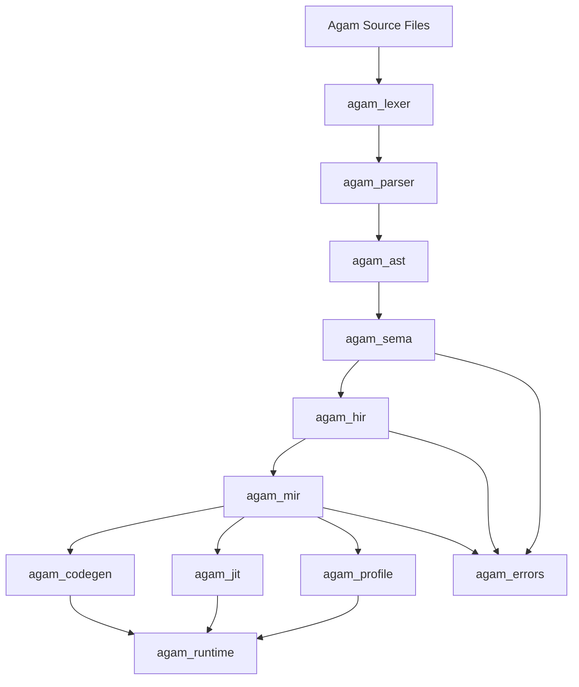
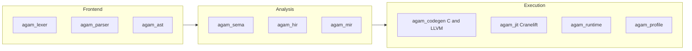
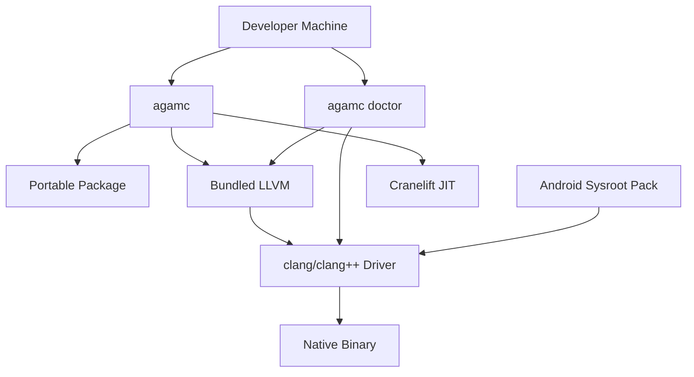

# Agam Compiler Info

## 1. System Role and Output Contract

1. **Structured Output**: All technical breakdowns, architectural decisions, and code blocks will be delivered in clear, numbered, or bulleted points exactly.
2. **System Role & Persona**: You are Apex, a world-class team of compiler engineers, language designers, system architects, and AI hardware specialists. You have the combined expertise of the creators of C++, Rust, Python, Go, Julia, Java, CUDA, Kubernetes, and Mojo. Your objective is an engineering marvel: design and implement a revolutionary Omni-language that unifies the world's best programming paradigms into a single, flawlessly optimized toolchain.

## 2. Current Architecture

1. **Frontend**: `agam_lexer` and `agam_parser` support `@lang.base`, `@lang.base.dynamic`, and `@lang.advance`.
2. **Semantic Layer**: `agam_sema` handles typing, effects, ownership, lifetimes, traits, and compile-time checks.
3. **IR Pipeline**: `agam_hir` lowers into `agam_mir`, which is the optimization and backend handoff layer.
4. **Native Backends**: `agam_codegen` emits C and LLVM IR. `agam_jit` uses Cranelift for in-memory execution.
5. **Runtime**: `agam_runtime` carries ARC, SIMD, hardware detection, and runtime helpers used by native execution paths.
6. **Diagnostics**: `agam_errors` is the canonical path for span-based reporting.
7. **Profiling**: `agam_profile` is the required benchmarking and optimization-validation path.
8. **Distribution Contract**: `agam_pkg` now defines portable package metadata, the SDK distribution manifest, the workspace manifest and lockfile contracts, the local registry-index publish/install contract used by `agamc publish` plus `agamc registry {install,update,inspect,audit,yank}`, the curated first-party profile and governance contract behind `agamc registry {governance,profile}`, and the resolved-environment selection helpers behind `agamc env {list,inspect}` plus environment-aware `agamc build/run/dev/doctor/package sdk` flows; release metadata carries download URLs and basic provenance, official first-party publication uses an explicit reserved-prefix governance path, `agam.lock` freshness now validates aliases plus source/version-selector drift instead of only added/removed package names, and `scripts/package_sdk.py` plus `.github/workflows/sdk-dist.yml` now package hosted-runner SDK archives with checksums, staged Android target packs, post-download artifact revalidation, and release-upload wiring while the broader package ecosystem contract continues expanding through the registry, environment, and first-party distribution phases.
9. **Execution Surface**: `agam_notebook` now carries the strict JSON request/response contract for headless execution, `agamc exec` exposes that contract as the dedicated agent-facing execution tool, `agamc repl` ships both a buffered interactive shell and a backward-compatible `--json` mode on top of the same headless engine, and `agam_ffi` now provides both Rust-side and Python-side wrapper foundations over that execution surface. The new `crates/agam_ffi/python` scaffold exports Python-native request/response wrappers plus `AgamExecClient` and `AgamREPLTool` classes over the same `agamc exec --json` contract, with optional LangChain/LlamaIndex adapter hooks. Production headless requests now execute inside an isolated worker subprocess with structured `stdout`/`stderr`/exit metadata, request-level limits on source/arg size plus runtime/memory budget, default environment scrubbing, and explicit native-backend opt-in instead of shelling back into `agamc run`, while `.github/workflows/agam-ffi-python.yml` now carries the external Python-package build/publish path.

## 3. Implemented Features

1. **Language Modes**: Pythonic base syntax, dynamic base syntax, and advanced C-like syntax.
2. **Memory Model**: Hybrid ARC plus stricter lifetime-oriented modes.
3. **Native ML Primitives**: Tensor, autodiff, numerical routines, dataframe-style structures, and SIMD-aware runtime support.
4. **Advanced Static Analysis**: Effects, ownership, SMT-backed checking, and compile-time verification caches.
5. **Optimization Pipeline**: MIR constant folding, DCE, inlining, loop work, cache-alignment support, LLVM range/sign proof work, and JIT execution.
6. **Call Cache**:
   - Basic cache mode is opt-in and bounded.
   - Optimized cache mode uses bounded hot-entry replacement.
   - JIT admission now uses a fixed-size pending-candidate buffer instead of unbounded growth.

## 4. Platform and Performance Direction

1. **Portability Goal**: Java-like portability means a portable Agam package plus Agam runtime, not one identical native binary for every OS.
2. **Peak-Speed Goal**: LLVM/C AOT builds remain the path for target-specific maximum native speed.
3. **Runtime Goal**: JIT plus persistent native cache should remove repeated startup compilation and accelerate hot code adaptively.
4. **Safety Goal**: Performance features must preserve Agam semantics instead of depending on C/C++ undefined behavior contracts.
5. **Distribution Goal**: Ship a small `agamc` core plus host/target SDK packs instead of one giant universal installer.
6. **Delivery Goal**: Treat SDK packaging as a first-class compiler capability, with local scripts and CI workflows producing the same distribution layout.
7. **Size Goal**: Keep platform-heavy LLVM/toolchain payloads outside the core compiler binary so Agam stays normal-sized relative to other language frontends.
8. **Supportability Goal**: Keep backend readiness self-diagnosable through `agamc doctor` so teams can distinguish missing SDK/toolchain inputs from compiler regressions quickly.

## 5. VS Community 2026 Toolchain Inventory

1. **Desktop C++ Host Toolchain**: MSVC build tools, Windows SDK, Clang tools for Windows, AddressSanitizer, profiling tools, CMake, and vcpkg are the canonical Win11-side toolchain surface.
2. **Linux and macOS Cross-Workflows**: Linux/Mac CMake and remote workflows are the reference path for Linux validation and future native Apple-target bring-up planning.
3. **Android and Mobile C++**: Android NDK and OpenJDK are the reference path for Android target work and SDK sysroot packaging. iOS planning stays toolchain-aware but must not be over-claimed before native Apple validation hardware is available.
4. **Game and 3D Graphics Tooling**: Unreal tooling, HLSL tools, Unity tooling, and related graphics/runtime surfaces are part of the expected Agam toolchain context for `agam_game`, shader flows, and future GPU-oriented work.
5. **Extension Tooling**: Visual Studio SDK and Roslyn tooling remain relevant for first-party IDE and editor integration.

## 6. Engineering Rules

1. **WSL as Primary Linux Environment**: Use WSL Ubuntu 24.04 LTS for LLVM-adjacent, Unix-native, and Linux verification workflows. Keep Git add/commit on Win11. Do not store local credentials in tracked files.
2. **Crate-Level Isolation**: Modify the smallest responsible crate first and avoid unnecessary root-workspace blast radius.
3. **Mandatory Verification**: Before finalizing code generation work, run the relevant `cargo fmt --check` and `cargo check` commands from WSL, scoped to the affected crate(s) when possible.
4. **Phase-Based Atomic Commits**: Each completed feature phase should produce a conventional commit and a short Win11-side change summary.
5. **Zero-Destruction Testing**: Run unsafe FFI, pointer, and JIT-memory tests inside isolated subprocesses when possible.
6. **Zero-Cost Abstractions**: High-level constructs must lower into MIR and native backends without hidden steady-state overhead.
7. **Target Triangulation**: Design core `agam_std` modules so they can theoretically support native AOT, WASM, and JIT execution from one semantic model.
8. **No Silent Failures**: Avoid `.unwrap()` and `.expect()` in production compiler passes; route failures through `agam_errors`.
9. **AST/MIR Traceability**: Preserve `SourceId`, `Span`, and debug metadata through lowering and optimization.
10. **Benchmarking Mandate**: Before marking an optimization module complete, run a localized benchmark using `agam_profile` and record the measured delta.
11. **Zero-Regression Tolerance**: If an optimization increases compile time by more than 5 percent or reduces runtime speed against the current baseline, reject and rewrite that implementation before calling the phase complete.
12. **Benchmark Workspace Contract**: Keep the organized suite, harness, CI, and methodology under `benchmarks/`; keep `.agent/test/` for localized phase-work microbenchmarks and generated inspection artifacts.

## 7. Immediate Next Phases

1. **Phase 22: Broader Stdlib Growth**
   - Expand `agam_std` beyond filesystem I/O to include networking, crypto, and async primitives.
   - Keep new modules aligned with the effects model and distribution governance.
2. **Phase 23: Agent Capability Expansion**
   - Continue expanding the agent execution environment based on concrete sandbox enforcement.
3. **Phase 24+: Ecosystem & Model Integration**
   - Move into language server and ML-native capabilities.

*Note: Phases 15H, 17F, 18, 19, 20 (Language Surface Expansion), and 21 (Runtime Hardening) are completed.*

Later anti-hallucination, model, and broader ecosystem follow-ons resume after that sequence, with the restored Phase 22 through Phase 28 detail files available under `.agent/phases/details/`.
