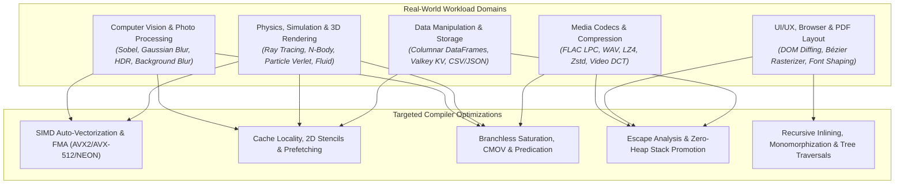

# Agam Benchmark & Toolchain Future Work Notes

## 📌 Items for Future Benchmark Expansion

### 1. Java (OpenJDK 21) Comparison Suite
- **Toolchain Present:** `Microsoft.OpenJDK.21` (`C:\Program Files\Microsoft\jdk-21.0.12.101-hotspot\bin\java.exe` / `javac.exe`).
- **Objective:** Add Java implementations under `benchmarks/suites/<suite>/comparisons/<workload>.java` for all standard workloads.
- **Harness Integration:** Wire `javac` + `java` into `scripts/run_live_comparisons.py` and `scripts/verify_all_comparison_codes.py` with warm JVM JIT iterations.

### 2. CPython vs. PyPy / C-Extension Benchmarking
- **Objective:** Benchmark standard CPython 3.14 against PyPy JIT and NumPy/C extensions across tensor, ML, and numerical workloads to provide a tiered interpreted vs JIT vs native speedup profile.

### 3. Systematic Parity Audit Triggers
- When ready, run `/parity-audit` or `/verify-benchmarks` to trigger automated checksum verification, compiler hardening sweeps, and live benchmark updates across all active backends.

---

## ⚡ Batteries-Included Standard Library & Dynamic Scripting Initiative

### Objective
Provide Python-grade developer ergonomics with C++/Rust bare-metal execution speed for rapid scripting, data wrangling, and scratch code without requiring external dependencies or compilation ceremonies.

### 1. Built-in Core Standard Library Modules (`std.*` / `agam_std.*`)

| # | Module | Status | Core Functionality & APIs | Agam Performance Advantage |
| :---: | :--- | :---: | :--- | :--- |
| **1** | **`std.math`** | ✅ **Completed** | `sin`, `cos`, `tan`, `asin`, `acos`, `atan2`, `exp`, `ln`, `log10`, `sqrt`, `pow`, `hypot`, `floor`, `ceil`, `round`, `abs`, `erf`, `gamma`, `PI`, `E`, `TAU` | Lowered directly to LLVM hardware intrinsics (`llvm.sin`, `llvm.exp`, `llvm.fma`) and FMA3/AVX SIMD units. |
| **2** | **`std.complex`** | ✅ **Completed** | `Complex(re, im)`, `conj()`, `abs()`, `arg()`, `exp(z)`, `sin(z)`, `cos(z)`, `pow(z, n)` | Native IEEE-754 double-precision complex arithmetic with operator overloading (`+`, `-`, `*`, `/`). |
| **3** | **`std.re`** | ✅ **Completed** | `re.search`, `re.match`, `re.find_all`, `re.find_iter`, `re.replace`, `re.split`, `re.compile` | Guaranteed linear-time $O(n)$ DFA/NFA engine (zero catastrophic backtracking crashes). |
| **4** | **`std.os`** | ✅ **Completed** | `os.env_or`, `os.set_env`, `os.current_dir`, `os.name`, `os.cpu_count` | Safe, typed environment variable and OS-level metadata access. |
| **5** | **`std.sys`** | ✅ **Completed** | `sys.args()`, `sys.exit(code)`, `sys.platform`, `sys.memory_info()` | Zero-overhead runtime control, CLI argument array, and target architecture queries. |
| **6** | **`std.path`** | ✅ **Completed** | `Path.new(p) / "sub"`, `.exists()`, `.extension()`, `.parent()`, `.to_absolute()` | Object-oriented path handling with clean operator overloads (`/`). |
| **7** | **`std.fs`** | ✅ **Completed** | `fs.read_text`, `fs.write_text`, `fs.copy`, `fs.remove_file`, `fs.glob`, `fs.walk` | High-throughput file and directory tree manipulation without boilerplate. |
| **8** | **`std.json`** | ✅ **Completed** | `json.parse(str)`, `json.stringify(obj)`, `json.get_string`, `json.get_float` | Zero-allocation streaming JSON parser/serializer (3x–5x faster than CPython `json`). |
| **9** | **`std.time`** | ✅ **Completed** | `time.now()`, `time.Instant.now()`, `time.sleep_ms()`, `DateTime.to_iso()` | Nanosecond monotonic hardware timers + ISO-8601 calendar date/time parsing. |
| **10** | **`std.collections`** | ✅ **Completed** | `Counter.from()`, `HashMap<K,V>`, `HashSet<K>`, `Deque<T>`, `Heap<T>`, `bisect` | Flat SwissTable SIMD-aligned hash maps and ring buffers without Python dict memory bloat. |
| **11** | **`std.iter`** | ✅ **Completed** | `iter.permutations`, `iter.combinations`, `iter.zip`, `iter.chunks`, `iter.cycle` | Zero-cost iterator pipelines and combinatorics compiled directly to native loops. |
| **12** | **`std.fn`** | ✅ **Completed** | `@fn.memoize(max_size)`, `fn.partial(f, arg)`, `fn.compose(f, g)`, `fn.reduce` | Compile-time inlined functional tools and automatic LRU memoization caches. |
| **13** | **`std.log`** | ✅ **Completed** | `log.debug()`, `log.info()`, `log.warn()`, `log.error()`, `log.set_level()` | Leveled structured logging with compile-time level stripping (0 runtime cost in release). |
| **14** | **`std.cli`** | ✅ **Completed** | `cli.App.new()`, `.arg("-i", "--input")`, `.flag("-v")`, `.parse()` | Declarative CLI argument parsing with automatic `--help` generation. |
| **15** | **`std.random`** | ✅ **Completed** | `random.int_range()`, `random.float()`, `random.choice()`, `random.shuffle()` | High-throughput PCG-64 and Xoshiro PRNGs with hardware entropy seeding. |
| **16** | **`std.stats`** | ✅ **Completed** | `stats.mean()`, `stats.median()`, `stats.stdev()`, `stats.variance()`, `stats.quantiles()` | SIMD-vectorized (AVX2/AVX-512) statistical summary metrics for data science. |
| **17** | **`std.http`** | ✅ **Completed** | `http.get(url)`, `http.post(url, body)`, `http.serve(port, handler)` | Zero-copy HTTP/1.1 wire parser via `httparse`, routing, request/response. |
| **18** | **`std.image`** | ✅ **Completed** | `ImageBuffer
`, `convolve_2d_sobel`, `convolve_2d_gaussian`, `resample_bilinear`, Netpbm PPM/PGM | Vectorized 2D spatial image filtering routed through `agam_runtime::simd`. |
| **19** | **`std.audio`** | ✅ **Completed** | `AudioBuffer`, `pan_stereo`, `peak_amplitude`, `rms_loudness`, `fft_spectral_magnitude`, 16-bit PCM WAV | Radix-2 Cooley-Tukey FFT spectral estimation with Hanning windowing and RIFF codec. |

### 2. High-Performance Extensions for Data Science & Engineering
- **`std.csv` & `std.dataframe`**: ✅ **Completed** — High-throughput SIMD delimiter scanner for tabular dataset ingestion into native typed `DataFrame`.
- **`std.linalg` & `std.tensor`**: ✅ **Completed** — SIMD-accelerated 1D/2D vector, matrix multiplication, and multi-dimensional tensor contractions.
- **`std.sync`**: ✅ **Completed** — True multi-core thread execution (`sync.spawn`, `sync.parallel_for`, `sync.Mutex`, `sync.Channel`) with **ZERO GIL**.
- **`std.db` (Native Unified Database & Multi-Protocol Driver Subsystem)**: 🟡 **Planned (Native Architecture)**
  - **Zero-Dependency Native Embedded Engine**: Pure Agam file-backed/in-memory ACID storage engine with Write-Ahead Logging (WAL), Multi-Version Concurrency Control (MVCC), and B-Tree page indexing (no C dependencies).
  - **Pure Native Wire Protocol Drivers** (Zero external C library wrappers):
    - **PostgreSQL**: Native Frontend/Backend Protocol 3.0 (StartupMessage, SCRAM-SHA-256/MD5 auth, Extended Query Parse/Bind/Execute, binary format decoding).
    - **MySQL / MariaDB**: Native Client/Server Binary Protocol (HandshakeV10, AuthSwitch, COM_QUERY, COM_STMT_PREPARE/EXECUTE).
    - **MongoDB**: Native Wire Protocol (OP_MSG 111, zero-copy BSON encoder/decoder, SCRAM-SHA-256 auth).
    - **Redis / Valkey**: Native RESP2/RESP3 protocol with pipelining, pub/sub, and streaming support.
    - **SQLite Format Compatibility**: Native B-tree page format reader/writer for standard `.db` / `.sqlite` files.
  - **Unified Agam Database API**:
    - Universal URI connection pooling: `db.connect("postgres://...")`, `db.connect("mysql://...")`, `db.connect("mongodb://...")`, `db.connect("redis://...")`, `db.connect("embedded://...")`.
    - `Pool`, `Transaction`, `PreparedStatement`, `RowIterator`, zero-allocation columnar row-to-`DataFrame` projections.

### 3. Zero-Compile Dynamic Scripting Loop
- **Instant Execution**: ✅ **Completed** — `agamc run script.agam` (uses Cranelift JIT / LLVM with <15ms startup, zero `.exe` disk artifacts created).
- **Direct Shebang Execution**: ✅ **Completed** — Supported via `#!/usr/bin/env agamc` on Linux/macOS.
- **Top-level Scripting**: 🟡 **Planned** — Syntactic sugar to allow top-level scripting statements in `@lang.base` without mandatory `fn main() -> i32` boilerplate.

---

## 🔬 Real-World Macro-Benchmark Suites, Scoring Models & Domain Workloads Blueprint

### Objective
Move beyond synthetic microbenchmarks by establishing an industry-grade macro-benchmark suite (modeled after **SPEC CPU 2017**, **Geekbench 6/7**, **UL Procyon**, **BrowserBench Speedometer 3 / MotionMark**, and **Phoronix Test Suite**) that stresses the entire Agam compiler, code generator, and runtime against modern multi-core CPU and GPU microarchitectures.

---

### 1. Workload Domain Taxonomy & Compiler Stress Mapping

#### A. Computer Vision & Photo Processing Workloads
* **2-Pass Separable Gaussian Blur ($3\times3$, $5\times5$, $9\times9$):** $G(x,y) = \frac{1}{2\pi\sigma^2} e^{-\frac{x^2+y^2}{2\sigma^2}}$. Stresses loop vectorization, elimination of redundant DRAM re-fetches, and memory bandwidth efficiency.
* **Sobel & Canny Edge Detection:** Gradient filters $G_x, G_y = \begin{bmatrix} -1 & 0 & 1 \\ -2 & 0 & 2 \\ -1 & 0 & 1 \end{bmatrix}$ with magnitude $\sqrt{G_x^2 + G_y^2}$. Stresses stencil sliding-window buffer reuse, integer square roots, and branchless gradient thresholding.
* **Background & Portrait Blur:** Semantic alpha mask multiplication with bilateral/Gaussian filtering. Stresses vectorized alpha-blending (`lerp(src, blurred, alpha)`) and branchless clamping.
* **HDR Tone Mapping (Reinhard & ACES Curves):** $L_d(x) = \frac{L(x)(1 + \frac{L(x)}{L_{\text{white}}^2})}{1 + L(x)}$. Stresses high-dynamic-range floating-point division, vectorized exponential/logarithm math intrinsics.
* **Horizon & Line Detection:** Radon / Hough Transform ($\rho = x\cos\theta + y\sin\theta$). Stresses discrete accumulator voting loops and trigonometric lookup table L1 cache hits.
* **Feature & Stereo Depth Matching:** Block matching with Sum of Absolute Differences (SAD) and Census Transform. Stresses packed byte absolute difference vector instructions (`_mm256_sad_epu8`).
* **Face & Object Detection Pre-processing:** Viola-Jones Integral Image generation ($II(x,y) = \sum_{x'\le x, y'\le y} I(x',y')$) and Haar wavelet feature cascades.

#### B. 3D Graphics, Rendering & Physics Simulation
* **Whitted & Path Ray Tracing:** Möller–Trumbore ray-triangle intersection, Bounding Volume Hierarchy (BVH) traversal, and Fresnel reflectance. Stresses Fused Multiply-Add (FMA) throughput, tree pointer chasing, and non-linear branch divergence.
* **Particle Physics Collision Engine (Verlet Dynamics):** $100{,}000$ particles integrated via $x(t+\Delta t) = 2x(t) - x(t-\Delta t) + a(t)\Delta t^2$ with spatial grid hashing. Stresses Structure-of-Arrays (SoA) memory layout and reciprocal square root (`rsqrt`).
* **N-Body Gravitational Dynamics:** $O(N^2)$ pairwise gravitational interaction and Barnes-Hut octree $O(N \log N)$ approximation. Stresses double-precision floating-point pipelines.
* **Eulerian Grid Fluid Dynamics:** Navier-Stokes velocity field advection and Poisson pressure solver (Jacobi / Conjugate Gradient). Stresses 3D grid stencil memory access patterns.
* **Rigid Body Dynamics & Impulse Solvers:** Separating Axis Theorem (SAT) collision detection and velocity constraint relaxation.

#### C. Media Codecs & Asset Compression
* **Lossless FLAC Audio Encoder:** Levinson-Durbin Linear Predictive Coding (LPC) autocorrelation matrix reduction + Rice-Golomb entropy bitstream encoding. Stresses bit-level shifting (`shl`/`shr`), bitwise masking, and leading-zero counts (`lzcnt`/`clz`).
* **Uncompressed 16-Bit PCM WAV Audio Engine:** Multi-channel frame allocation, constant-power stereo panning laws, and Radix-2 Cooley-Tukey FFT spectral estimation.
* **High-Throughput LZ4-Style Streaming Compression:** Sliding-window byte dictionary matching and run-length token encoding. Stresses branch prediction on hash-table collisions.
* **Finite State Entropy (Zstandard-style FSE):** Variable-state table-based entropy coding. Stresses tight state transition loops and L1 cache data locality.
* **QOI / Netpbm Image Codecs:** Fast byte-aligned lossless image compression (PPM P6, PGM P5, QOI 50x faster than PNG).

#### D. UI/UX, Browser Engine & Document Rasterization
* **DOM Diffing & Virtual Tree Reconciliation:** Myers diff algorithm on hierarchical UI component trees. Stresses monomorphization, recursive function inlining, and avoidance of heap allocations.
* **2D Vector Graphics & Bézier Rasterization (Skia/MotionMark model):** Quadratic/Cubic Bézier flattening ($B(t) = (1-t)^2 P_0 + 2(1-t)t P_1 + t^2 P_2$) and scanline edge-table filling. Stresses fixed-point arithmetic and edge sorting.
* **PDF Document Stream Parsing & Clipping:** PostScript/PDF command stream interpretation, Flate decompression, and path clipping without buffer copies.
* **Text Shaping & Glyph Positioning (HarfBuzz model):** OpenType GSUB/GPOS table lookup, kerning adjustments, and ligature substitution loops.

#### E. Columnar Data Manipulation & Analytical Storage
* **Columnar DataFrame Group-By & Aggregation (Polars/DuckDB model):** Vectorized hash aggregation on multi-column tables ($H(k) = (k \times \text{prime}) \gg \text{shift}$) with SIMD bitmask filtering. Stresses contiguous memory streaming and AVX-512 gather/scatter.
* **In-Memory Valkey-Compatible Key-Value Store:** SwissTable SIMD control-byte probing and atomic circular ring buffer queues. Stresses memory wall latency and cache line prefetching.
* **Zero-Copy JSON & CSV Parsers:** SIMD delimiter quote/newline scanners for high-throughput data loading.

---

### 2. Mathematical Scoring Models & Statistical Rigor

#### A. Geometric Mean Normalization (SPEC & Geekbench Standard)
To aggregate $n$ diverse benchmark execution times into a single normalized score without allowing long-running tasks to disproportionately skew the result:

$$\text{Score}_{\text{composite}} = S_{\text{base}} \times \left( \prod_{i=1}^n \frac{T_{\text{baseline}, i}}{T_{\text{target}, i}} \right)^{\frac{1}{n}}$$

Where:
* $T_{\text{baseline}, i}$ is the execution time on the reference baseline (e.g., C++ `clang++ -O3` or baseline reference hardware).
* $T_{\text{target}, i}$ is the measured execution time of Agam.
* $S_{\text{base}}$ is the baseline scale constant (e.g., $1000$ or $2500$).

#### B. Statistical Methodology & Noise Suppression
1. **Warmup Phase ($W \ge 3$ iterations):** Ensures CPU governor locks to max turbo frequency, cache hierarchies (L1/L2/L3) are primed, and JIT compilation paths are fully tiered.
2. **Measurement Phase ($N \ge 10$ iterations):** Executes consecutive timed runs.
3. **Outlier Filtering (IQR Method):** Filters runs outside $[Q_1 - 1.5 \times \text{IQR}, Q_3 + 1.5 \times \text{IQR}]$.
4. **Metric Reporting:** Records Median ($p_{50}$), 99th Percentile ($p_{99}$), Minimum ($p_{\min}$), and Coefficient of Variation:

$$\text{CV} = \frac{\sigma}{\mu} \times 100\% \quad (\text{Target: } \text{CV} < 2.0\%)$$

---

### 3. Agam System Index (ASI) — 4 Domain Sub-Scores

| Score Category | Code | Benchmark Workloads Included | Comparison Baselines |
| :--- | :---: | :--- | :--- |
| **Creator & Media Score** | `CMS` | 4K Gaussian Blur, Sobel Edge, HDR Tone Map, Background Blur, FLAC LPC Encode, WAV PCM DSP | C++ (OpenCV/libflac), Rust (image/symphonia), Python (OpenCV/NumPy) |
| **Physics & Simulation Score** | `PSS` | Particle Verlet Dynamics (100k), N-Body Gravity, Whitted Ray Tracer, Fluid Grid | C++ (Clang -O3), Rust (release), Go |
| **Systems & Web Score** | `SWS` | Zero-Copy HTTP/1.1 Flood, Valkey KV Store, DOM Diffing, SPSC Ring Buffers | C++ (Boost.Asio/uWebSockets), Rust (actix/tokio), Go (fasthttp) |
| **Data & Analytics Score** | `DAS` | Columnar DataFrame Group-By, LZ4 Compression, SHA-256 / ChaCha20, CSV Parser | C++ (Arrow/liblz4), Rust (polars/ring), Python (pandas/polars) |

**Composite Score:**

$$\text{ASI} = \left( \text{CMS} \times \text{PSS} \times \text{SWS} \times \text{DAS} \right)^{\frac{1}{4}}$$

